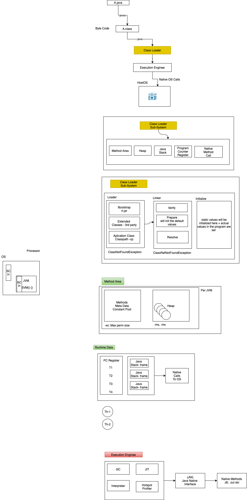

    # JAVA Batch  AEM  2021 October 

  
- Rishabh - Btech electrical, bikaner, playing cricket, - watching movies - 6 /10 
- Aakash - Btech IT, playing TT, 4 / 10 
- Amit - Btech CS Bhopal MP, Wating movies, web series, 5/10 
- Ashutosh - Patna, Bihar, Btech kolkatta, CS, play cricket, 6.5/10
- Arjun - Btech CS, VIT, exploring foods, 4/10
- Bhavya - Btech, CS, AP, watching movies, listening music 5.5/10
- Hemanth - Btech E&C, 6.5/10, travelling 
- Lokesh - IT, Bareli, play cricket, swim ,  4/10
- Manav - Btech, CS, play foot ball, mutualfunds, cryptocurrency, 4/10 
- Mayuresh - Pune, BE CS, Dance, cricket, volley ball, 6.5/10
- Pankhuri - E&C, PSIT Kanpur, painting, listening music 4.5/10
- Ronak - CS, Ahmedabad, 8/10, stock markets, documentaries
- Sajid - CS,  delhi, python, C++, football 
- Srishti - CS, Kolkatta, writing quora, 6/10
- Shivanand- B tech, EC, learning technologies 6/10
- Utkarsh - Lukhnow, Btech CS, reading books, travelling 6/10 
- Vishav -  BE, E&C , travel, 3/10 
- Arti - Btech, CS, play badminton, cooking, 7/10 
- Yogesh - CS, Mumbai university, play chess, walking in evening, reading books, 5/10


## List of OOPS Concepts in Java 
- Inheritence 
- Encapulation
- Abstraction
- Polymorphism 

### JVM 
- - What is JVM 
- Change src to byte code 
- Platform independent 
- JDK VS JRE 
- in JRE you have JVM 
- JDK - Helps in compiling 

<hr/>


### Hello World Program 
```
public class Hello {
    public static void main(String [] args) {
        int x=10; 
        boolean flag; 
        System.out.println("Hello");
        System.out.println(x);
        System.out.println(flag);
        hi();
    }

    void hi() {}
}
```


- C / C++ 
```
#DEFINE main hello
    int hello() {}


    void main() {}
```


### Platform Independence 
- Windows - Java -> .java -> .class -> jvm 
- Mac - Java -> .java -> .class -> jvm 
- Sun Solaris  - Java -> .java -> .class -> jvm 
- Linux - Java -> .java -> .class -> jvm 
- 


### Tools needed 
- We will use Java- - IDE - Eclipse, IntelliJ, VS Code, Net Beans 




### Software List 
- https://www.eclipse.org/downloads/packages/release/neon/3/eclipse-ide-java-ee-developers
- https://git-scm.com/downloads
- https://code.visualstudio.com/download
- https://www.oracle.com/java/technologies/downloads/#java-  

## Day 1 Agenda 
- Creating Classes in Java, 
- Working with Classes in Java, 
- Making methods and classes final, 
- OOPS- Inheritance,
- Overriding methods, 
- Packages -Package access
- Documentation comments,  

## List of OOPS Concepts in Java 
- Inheritence 
- Encapulation
- Abstraction
- Polymorphism 


### Usage of variables 
- packages - lower case (com.ps.beans, org.ps.controller)
- varaibles - camel case (empId, salaryDrawn, address, withDraw)
- method names - camel case (getEmpId(), withDrawSalary(), makePayment(), getDataFromServer())
- class names - pascal case (Employee.java, HelloWorld.java, SomeController.java)
- constants - uppercase - (PI, LOCATION, VERSION)
- +++ indentation 

- What is a class 
    - is blue print of the object, 
    - Every class shall have characteristics 
  
- What is a Object 
- What is instance variable 
- what is static variable 
- What is static method 
- what is static block  
- what is local variable 


class Employee {
    int empId; 
    String empName;
    float empSalary
    int empDept;
    int empAge;

    void hi() {
        int x; 
    }
}


Employee e; 
Employee e = new Employee(); 


- jar file is collection of class files + properties etc 
- java documentation to understand .jar content 
- WORM - Write Once Read Many 
- DRY - Dont Repeate Yourself 


### Access Specifiers 
- Encapulation
  - public 
  - private 
  - protected
  - default (package)
- keep all your variable private, you access it with getters / setters 

### Access Modifiers 
- final 
- static 
- synchronized 
- Abstract 


PS 
- Employee (name, salary, address) -> injected to the system -> (***) -> Employee Details + EmpId (static)


- Inheritence  (Parent - child )
  - is-a (extends)
    - Employee is a Person 
    - Human is a animal 
    - ProjectManager is a Employee 

    - In java only simple inhe, multi level inhe is possible 


    ```
        class Car {
            public void drive() {}
            prirvate void drive1() {}
        }
        class Maruti extends Car {
             public void drive() {}
             void drive1() {} (x) 
        }
        class Hyundai extends Car {}
    ```


  - has-a 
    - Car has a mirror 
    - Bike has a petrol tank 
    - Holds the reference of another object 


```
    class Employee  {
        private int empId; 
        private Name name; 
        private double salary; 
        private Address address; 
    }

    class Customer  {
        private int customId; 
        private Name name; 
        private double income; 
        private Address address; 
    }

    class Address  {
        private int hNo; 
        private String street; 
        private int pin;
        private String state; 
        private String city; 

    }   

    class Name {
        private String firstName; 
        private String lastName; 
    }


    Employee emp = new Employee(); 
    Name name = new Name(); 
    name.setFirstName("Ronak"); 
    name.setLastName("Parmar"); 
    ...
    emp.setName(name); 
    ...

```


- polymorphism 
   1. Compile time 
      1. with the help of overloading it is done either by  method or constructor 
      2. same method name diff signature 
      3. happens in same class
   2. Run time 
      1. Overriding with method only 
      2. same method name same signature 
      3. happens in different class provided they are inherited (parent - child )
   
<br >

- if you have the class marked as final then you cannot inherit 
- if you have method marked as final then you cannot override 
- if you have the method as private then you cannot override 
- if you have the method as static then inheritence is not supported 


final - class level, method level, for constants 

```

class Dad - final
    - work 


class son(you)
    - work @Override 
    - play 


class son(brother)
    - work 
    - trekking 
 
 Dad <-  son 
 son(brother) <- son(you)
```


## Assignment 
```
    class Car {
        public void move() {
            System.out.println("Moves car"); 
        }
    }

    class SUV extends Car {
        boolean fourWheelDrive() {
            return true; 
        }
    }
    class HatchBack extends Car {
        public int fuelCapacity() {
            // generate random number (20-40)
            return the value 
        }
    }

    class Maruti extends SUV {
        // have few more methods
    }
    ... 

    class Maruti extends HatchBack {

    }
    

    class Client {
        public static void main(String [] args) {
            
        }
    }
```


# Day2 

- retro 
- how jar works 


## Agenda 
- Exception Handling and Assertions
- Exception handling with try-throw-catch-finally construct	
- Reference Types and Threading, 
- Working with types: Wrapper classes 


## List of OOPS Concepts in Java 
- [x] Inheritence 
- [x] Encapulation
- [x] Abstraction
- [x] Polymorphism 

- draw a car 


```
    abstract class Vehicle {
        public abstract void move();
    }
    abstract class Car extends Vehicle  {
        public abstract void steering();
        public void doors() {
            // all cars will have 4 doors 
        }
    }
    class Maruti extends Car {
        + Overriden Method move()
        public void abs() {}
    }
    class BMW extends Car {
        + Overriden Method move()
        public void airBags() {}
    }
```


## Abstraction 
- if you have a abstract method in the class it should be marked with ; 
- if you have atleast 1 abstract method then the class has to be marked as abstract
- if you have the abstract class then you cannot create an object (instantiate), but remember you can hold reference 
  - Car c; 
- if you have a abstract class which extends abstract class then having the implementation is optional 
- if you have any class which extends abstract class then the abstract mehtods should be overrident MANDATORY 
- an abstract class can have mix of abstract methods and concrete methods 

## Exception 

- if you have unchecked exception then you dont have to handle it explictily, JVM will take care by default 
- try - catch 
- try - catch catch 
- try - catch (specific) catch (specific) catch (generic)
- try - try - catch - try - catch 
- try - catch - finally 
- try - finally 
- try - catch -fianlly - try -catch 


### custom exception 
Salary - IT Return - declares some min salary limit - thorw some exception 
    - SalaryImproperException 
    - NameTooShortException 

throw - you can throw only 1 exception, is at statement level, your exception or java's exception 
throws - you can throw multiple, is at method level, your exception or java's exception 


## Interface's 
- Java support multiple inheritence with interfaces only 
- you can have a class implmenting more than 1 interfaces 
- an interface can extend 1 or more interfaces 
- an interface is 100% abstract 
- an interface is declared with keyword interface 
- an interface has nothing to do with object class 
- in interface the only access specifier is public 
- in interface you cannot have variables > final, static 


```
    interface Car {
        move(); 
    }
    interface IndianStandard {
        tyreMinSize();
    }
    interface KarnatakaStandara extends IndianStandard {

    }

    // the class implementing the interface have to override 
    // the mehtods which are in interface 
    class Maruti implements Car, IndianStandard {
        
    }
```


| Abstract Classes              | Interface                       |
| ----------------------------- | ------------------------------- |
| Class                         | Interface                       |
| Multi level                   | Multiple                        |
| extends                       | implements                      |
| has reference to object class | Nothing to do with Object class |
| can have concrete mehtod      | 100% abstract                   |
| you can have variables        | no variables here               |


- why are we using wrapper class why not type casting 
  - it gets associated with class 
  - from converting from one object to another object 
    ```
        int x=10; 
        double d = x; 
        short s = (short) d; 
    ```

- it cannot be directly stored in to secodary device (serialize)
- collection & generics they dont support primititve 
- to support java.util packages 
- one int x  -> two  


## Threads 

| Process                  | Threads                          |
| ------------------------ | -------------------------------- |
| OS Concept               | Programming concept              |
| Java, MS Word, Excel etc | main, T1-ronak, T2-ashotosh etc  |
| all controlled by OS     | Controlled by Developer          |
| priority managed by OS   | You can set  Min 1 Max 10 Norm 5 |


### Creating a thread 
1. Extend a class with Thread class 
2. Implmenting an interface Runnable (run)

plan 
casestudy 
github 


- What services are needed 
  - Beans 
  - Array 
  - Some Business logic which can work at CLI 
  - 


- on desktop 

> git config --global user.name "Naveen Kumar Srinivas (C)" 

> git config --global user.email "navkumar35@partners.publicisgroupe.net"

> git clone https://tools.publicis.sapient.com/bitbucket/scm/poatb/training.git

> git branch -a 

> git checkout main 

> ls 

> git add . 

> git commit -m "your comments" 

> git push origin main 

> git pull 


T1 - RONAK, MANAV 
T2 - AMIT, AAKASH 
T3 - ASHUTOSH, RISHAB
T4 - PANKHURI, ARJUN 
T5 - ARTI, MAYURESH 
T6 - SRISHTI, HEMANTH 
T7 - SAJID, LOKESH
T8 - UTKARSH, YOGESH
T9 - BHAVYA, VISHAV, SHIVANAND 


# Day 3 

- [x] Java Generics & Collections
- [x] Generics and Annotations
- [x] Collection classes,LIST, SET, MAP, GRAPH
- [ ] I/O Package 
  - InputStream , OutputStream classes, 
  - Reader Classes, and Writer classes	


- Generics 

List<> - raw types 
    - Hemanth
    - Shivanand
    - Tiger
    - Ant 
    - Elephant 

- type safe 
List< Integer >
    - 23
    - 45
    - 66
    - 77
    - 44
  
List < Employee >
    - Hemanth 
    - Shivanand 
    - Lokesh
    - Arti 


int arr [] = new int [4]; 
arr[0] = 100; 
arr[1] = 200; 
arr[2] = 300; 
arr[3] = 400; 
arr[4] = 500;  [x]

java.util 

- Iterable 
  - iterator() 
  - Collection 
    - ArrayList is a raw type. References to generic type ArrayList<E> should be parameterized
      - List  (stores duplicate also )
        - ArrayList 
        - Vector 
        - LinkedList
        - Stack 
        - Queue
      - Set (stores unique only )
          - HashSet - Unordered - Store First Stratergy 
          - TreeSet - Ordered- sorted (asc / desc) - the object should implement Comparable interface 
          - Comparator
Employee [empId=103, empName=Akash, age=21], 1221555852
Employee [empId=103, empName=Akash, age=21], 1705929636
Employee [empId=102, empName=Bhavya, age=21], 1297685781
Employee [empId=101, empName=Rishab, age=22], 5- 3308


Employee [empId=103, empName=Akash, age=21], 65
Employee [empId=103, empName=Akash, age=21], 65
Employee [empId=101, empName=Rishab, age=22], 82
Employee [empId=102, empName=Bhavya, age=21], 66


Employee [empId=103, empName=Akash, age=21], 65
Employee [empId=101, empName=Rishab, age=22], 82
Employee [empId=102, empName=Bhavya, age=21], 66


      - Map
        - HashMap
        - LinkHashMap
        - TreeMap
        <Key, Value> - Key - is unique, overrite 

        class FoodItem {
            String name; 
            double cost; 
        }

        Map<String, FoodItem> choice = new HashMap<String, FoodItem> (); 
        <"rishab", new FoodItem("Pizza", 100)>
        <"hemanth", new FoodItem("Burger", 234)> 

        List<FoodItem> choices = new ArrayList<FoodItem> (); 
        choices.add(new FoodItem("Pizza", 100)); 
        choices.add(new FoodItem("Burger", 200)); 

         <"rishab", choices>

        Map<String, List<FoodItem>> rishabChoices = new HashMap<String, List<FoodItem>>();


        Map<String, Map<String, List>>

        Map<String, List<Map<String, List>>>


to represent graph 

class Node {
    List<Node>
    int val; 
}

- Property 

GoodMorning - Good Morning, Shubodaya, Bonjour, 
GoodNight - Good Night, Shubharatri, bonne nuit

Map<String, String [] >
Map<String, ArrayList<String>>


- IO Operations 
  - Char - Reader /Writer 
  - Byte - InputStream / OutPutStream - you have to serialize 


---------------- 

1. Store new Synoym 
2. Get Synonym for Word
3. Exit 

1. Enter word 
   Hello 
    Please enter synonym (0 to exit)
    Bon 
    Hello 
    Namskara 
    0 

1. Store new Synoym 
2. Get Synonym for Word
3. Exit 

2. Please enter a word to look for synonym: Hello <enter>
    Bon 
    Hello 
    Namskara 

--- 
Difference Between 
- Scanner - function, all data is got in 1 go , sc.nextInt(), scanf, 
- Buffered Reader/InputStream - read data in the form of text / bytes, br.readLine() (ISR), cin >> , throws checked exception IOException 


--- 
# Day 4

What is a build tool?, Overview of Maven, Environment Setup, Maven POM File, Creating a java project using maven, Maven Directory Structure, Project
o External Dependencies
Maven Repository
Build Lifecycle, phases and goals
Executing the mvn command

Introduction to Git,  Creating branch, working with merge stratergy, working with remote Github/bitbucket"	


tools.publicissapient.com/bitbucket/yourrepo (username + password )

--global - shivanand 
--system - ronak 
--local - only for specific folder 

> c:\myfolder 

> c:\yourfolder 

> c:\somefolder 

> git config --global user.name "naveen kumar"

> git config --global user.email "llid@publicissapient.com"

> git config --global --edit 


> <esc> :wq - write and quit 
> <esc> :q - quit 
> <esc> :q! - force quit 

-   git commit -m "created main in first and package statement in second"
 -   git status
 
 - git remote -v 
 
 -   git branch 
 
 -   clear
 
 -   git log 
 
 -   git log --oneline 
 
 -   clear
 
 -   git branch new-branch
 
 -   git branch 
 
 -   pwd
 
 -   code . 
 
 -   clear
 
 -   git branch 
 
 -   git checkout new-branch 
 
 -   git branch 
 
 -   git status 
 
 -   git add . 
 
 -   git commit -m "class created"
 
 -   clear
 
 -   git branch 
 
 -   git checkout main 
 
 -   git checkout new-branch
 
 -   git checkout main 
 
 -   git add . 
 
 -   git commit -m "added syso"
 
 -   git status
 
 -   clear
 
 -   git branch 
 
 -   git checkout new-branch 
 
 -   git branch 
 
 -   git checkout main 
 
 -   git branch 
 
 -   git merge new-branch
 
 -   git branch 
 
 -   cler
 
 -   clear
 
 -   git log --oneline
 
 -   git log --oneline --graph --all 
 --decorate
 
 -   history --30 
$
 history -50


 -   ls

 -   vi Second.java

 -   git status 

 -   cat First.java

 -   cat Second.java

 -   git status 

 -   clear

 -   git add . 

 -   git status

 -   git commit -m "created main in first 
 and package statement in second"
 
 -   git status
 
 - git remote -v 
 
 -   git branch 
 
 -   clear
 
 -   git log 
 
 -   git log --oneline 
 
 -   clear
 
 -   git branch new-branch
 
 -   git branch 
 
 -   pwd
 
 -   code . 
 
 -   clear
 
 -   git branch 
 
 -   git checkout new-branch 
 
 -   git branch 
 
 -   git status 
 
 -   git add . 
 
 -   git commit -m "class created"
 
 -   clear
 
 -   git branch 
 
 -   git checkout main 
 
 -   git checkout new-branch
 
 -   git checkout main 
 
 -   git add . 
 
 -   git commit -m "added syso"
 
 -   git status
 
 -   clear
 
 -   git branch 
 
 -   git checkout new-branch 
 
 -   git branch 
 
 -   git checkout main 
 
 -   git branch 
 
 -   git merge new-branch
 
 -   git branch 
 
 -   git log --oneline
 
 -   git log --oneline --graph --all --decorate


-   git branch --help
-   git branch -a
-   git branch -d new-branch 
-   git branch -a 
-   git checkout --help
-   git checkout -b my-new-branch main 
-   git branch 
-   git diff main..my-new-branch
-   git status 
-   git add . 
-   git commit -m "new method called hello in my-new-branch"
-   git diff main..my-new-branch
-   git diff main^..my-new-branch
-   git diff main..my-new-branch^
-   git diff main..my-new-branch^^
-   git branch 
-   git branch -m new-branch
-   git branch 
-   git checkout main 
-   git branch 
-   git branch --merged
-   git branch --no-merged
-   git merge new-branch
-   git branch --no-merged
-   git log --oneline
-   git checkout -b intrim-checkout d127555
-   git branch 
-   git checkout main 
-   git log 
-   git log --oneline 
-   git log --oneline  -5 
-   git branch -d new-branch
-   git log --oneline 
-   history -20 
-   history -30 


- Branching strategy 
- Mono Repo Concept 


- create project 
    - command line 
      - mvn archetype:generate -DgroupId=com.mycompany.app -DartifactId=my-app -DarchetypeArtifactId=maven-archetype-quickstart -DarchetypeVersion=1.4 -DinteractiveMode=false
    - IDE - Eclipse 


log4j 
log4j2 
logback
slf4j 
etc... 

----

# Day 5 

-  Retro - Day 4 
- alternative of maven 
- what is the need of git how it is efficient 
- what is maven why do we use maven 


Section 1 - Lambda Expressions
Interface Static Methods , Default Methods, Functional Interfaces , Lambda Syntax, Using Lambdas, Function Descriptors, Method References, Choosing Functional Interfaces, Constructor References, Closures, Lambda Compositions

Section 2 - Streams API
What are Streams?, Stream Advantages,Stream Operations, Streams vs. Collections
Filtering and Mapping, Finding and Matching, Reductions
Numeric Streams,Infinite Streams, Building Streams, Collectors
Grouping and Partitioning, Parallel Streams 	

try 
    - Constructor References
    - Infinite Streams (random) or you should not pass the limit 


Afternoon 
    - Collectors
    - Grouping and Partitioning

```
    class MyClass {
        public static void main(String args[]) {
            Thread t = new Runnable() {
                public void run() {
                    // blah blah... 
                }
            }
        }
    }

    interface Runnable {
        public void run();
    }


 class MyClass {
        public static void main(String args[]) {
            Thread t =  () -> {// blah blah... };
            }
        }
    }

```

Hi -> BYE 


- consice 
- Increses the readability 
- reduces boiler plate code 
- it encourages funcational programming -> async 
- The jar file when we build will be compact 
- Code reuse etc... 


https://openjdk.java.net/jeps/126

```
    public void add(int x, int y) {
        return x +y 
    }

    ... 
    int res = add(10, 20); 

    int res = (x, y) -> x + y; 

```

- if an interface has 1 mehtod then it is called as funcationa interface 
- 


difference between collection and streams 
|----|-----|
| collection                        | stream                                                             |
| --------------------------------- | ------------------------------------------------------------------ |
| this is stored                    | this is used for computation                                       |
| the size can grow / shrink        | fixed Data structure                                               |
| it can be passive                 | it is only active                                                  |
| was there from long time          | introduced in Java 8                                               |
| they dont use funcation interface | they use funcational interface                                     |
| no concept of parallel processing | supports parallel processing                                       |
| you can modify the content        | streams dont modify the content, Integer, Float, Double, String... |
| ---                               | ---                                                                |


    - in lambda Way 
        accountList.sort((o1, o2) -> o1.getCustName().compareTwo(o2.getCustName())); 
    - in method reference way 
		accountList.sort(Comparator.comparing(Account:: getCustName));


T1 - RONAK, MANAV - Amit 
T2 - AMIT, AAKASH - Ashotosh
T3 - ASHUTOSH, RISHAB - Pankhuri
T4 - PANKHURI, ARJUN - Arti 
T5 - ARTI, MAYURESH - Srishti 
T6 - SRISHTI, HEMANTH - Sajid 
T7 - SAJID, LOKESH - Utkash 
T8 - UTKARSH, YOGESH - Bhavya 
T9 - BHAVYA, VISHAV, SHIVANAND -Ronak 


@Slf4j
Causes lombok to generate a logger field.

Complete documentation is found at the project lombok features page for lombok log annotations.

Example:

 @Slf4j
 public class LogExample {
 }
 
will generate:
 public class LogExample {
     private static final org.slf4j.Logger log = org.slf4j.LoggerFactory.getLogger(LogExample.class);
 }


 ----------------------


 # Day 6 

 - Assessment 
   - bitbucket https://tools.publicis.sapient.com/bitbucket/scm/poatb/assessment-1.git
   1. - git clone https://tools.publicis.sapient.com/bitbucket/scm/poatb/assessment-1.git
   2. git checkout main 
   3. git branch LLID-FIRSTNAME syntax, ex: git branch mankakka-manav, git branch panawasti-pankhuri
   4. git checkout mankakka-manav
   5. git branch 
   6. start writing the code 
   7. repeat git add ., git commit -m "assessment-1 submission by manav"
   8. git push origin mankakka-manav
1. Coding style 
   1. /** @author manav @see to insert record  */ 
   2. good naming conventions 


T1 - RONAK, MANAV - Amit 
T2 - AMIT, AAKASH - Ashotosh
T3 - ASHUTOSH, RISHAB - Pankhuri
T4 - PANKHURI, ARJUN - Arti 
T5 - ARTI, MAYURESH - Srishti 
T6 - SRISHTI, HEMANTH - Sajid 
T7 - SAJID, LOKESH - Utkash 
T8 - UTKARSH, YOGESH - Bhavya 
T9 - BHAVYA, VISHAV, SHIVANAND -Ronak 


{12.50=[Product 
            [name=marker, qty=133, price=12.50]
        ], 
23000.67=[Product 
            [name=laptop, qty=11, price=23000.67]
          ], 
65000.00=[Product 
            [
                name=laptop, qty=33, price=65000.00]
            ], 
3.67=[Product 
            [
                name=tag, qty=30, price=3.67
            ], 
    
    Product 
        [name=paper, qty=32, price=3.67], 
    Product 
        [name=paper, qty=32, price=3.67]
    ], 
19.99=[Product 
    [
        name=marker, qty=21, price=19.99
        ]
    ]
}

----------------
{12.50=[Product [name=marker, qty=133, price=12.50]], 23000.67=[Product [name=laptop, qty=11, price=23000.67]], 65000.00=[Product [name=laptop, qty=33, price=65000.00]], 3.67=[Product [name=tag, qty=30, price=3.67], Product [name=paper, qty=32, price=3.67]], 19.99=[Product [name=marker, qty=21, price=19.99]]}


------------------------ anonymous block vs named block vs lambda ------------------------------ 

```
1. 
@Data 
class Employee implements Comparable<Employee>{
    private int empId;
    private String empName; 

    public void compareTo(Object obj) {
        // lexographical check  
    }

}

class App {
    psvm() {
        new TreeSet<Employee>();
    }

}


2. @Data 
class Employee{
    private int empId;
    private String empName; 
}

// named way 
class EmployeeSorterTemplate{
    public List<Employee> sortAscByName(List<Employee> list) {
        Comparare<Employee> compare = new Compare<Employee>() {

            @Overrident
            public void compare(Employee e1, Employee e2) {
                    // you lexographical check 
            }   
        };

        Collections.sort(list, compare); 

    }
}


3. @Data 
class Employee{
    private int empId;
    private String empName; 
}

// un-named way 
class EmployeeSorterTemplate{
    public List<Employee> sortAscByName(List<Employee> list) {
        Collections.sort(list, new Compare<Employee>() {

            @Overrident
            public void compare(Employee e1, Employee e2) {
                    // you lexographical check 
            }   
        }); 

    }
}

4. 
// un-named way 
class EmployeeSorterTemplate{
    public List<Employee> sortAscByName(List<Employee> list) {
        Collections.sort(list,(Employee e1, Employee e2) ->  {
                    // you lexographical check 
        }); 

    }
}

class App {
    psvm() {
        new TreeSet<Employee>();
    }

}


```
 
> LambdaEx01.class
> LambdaEx01$1.class - 1. LambdaEx01 2. $1 - LambdaEx01$1$1.class - LambdaEx01$1$2.class
> LambdaEx01$2.class - 1. LambdaEx01 2. $2


-- HashMap 
    public V put(K key, V value) {
        return putVal(hash(key), key, value, false, true);
    }
-- HasTable 
    Account.balance = 1000;  - 10:00:00:00, - 10:00:00:01   -> if i allow get operation its okay, but should not withdraw again 
    public synchronize  void withDraw(Account account, Long amount) {
        if(amount < account.balance) {
            //process 
            /// the DB call is made - 500 ms 
            // updating the data - 500 ms 
            // confirming - 100 ms (total 1100ms)
        }
    }

     public synchronized V put(K key, V value) {
         ...
     }


-- list 
 private void add(E e, Object[] elementData, int s) {
        if (s == elementData.length)
            elementData = grow();
        elementData[s] = e;
        size = s + 1;
    }
-vector 
     public synchronized void addElement(E obj) {
        modCount++;
        add(obj, elementData, elementCount);
    }


A - Atomiticy 
C - Consitencey
I - Isolation 
D - Durability 


----- 
# Day 7 

---- 

T1 - RONAK, MANAV - Amit 
    - discussed about case study 
    - 
T2 - AMIT, AAKASH - Ashotosh
    - 
T3 - ASHUTOSH, RISHAB - Pankhuri
T4 - PANKHURI, ARJUN - Arti 
T5 - ARTI, MAYURESH - Srishti 
T6 - SRISHTI, HEMANTH - Sajid 
T7 - SAJID, LOKESH - Utkash 
T8 - UTKARSH, YOGESH - Bhavya 
T9 - BHAVYA, VISHAV, SHIVANAND -Ronak 


Basic overview of data structures - List, Map, Graph
Mutable vs Immutable, Iterating over Data Structures
Basic Search Algorithms - Binary, Quick, Merge : pros/cons
Understanding how to identify Time Complexity 
Choosing appropriate DS and Algo for Problem


|-------|---------|
| Algorithm                                               | Program                               |
| ------------------------------------------------------- | ------------------------------------- |
| Design                                                  | Implementation                        |
| step by step procedure to define given problem statment | Implemenation of an algoritm          |
| Domain Knowledge                                        | programming knowledge                 |
| any language                                            | specific language                     |
| dont worry about OS or H/W                              | worry about OS or H/W                 |
| design                                                  | implement + test                      |
| which takes an input and gives output                   | which takes an input and gives output |

--- 


| prior ananlysis                  | postiror analysis               |
| -------------------------------- | ------------------------------- |
| algorithm                        | program                         |
| agnostic to programming language | language dependent              |
| time and space complexity        | hardware (amout of data/ bytes) |
| -------------------------------- | ------------------------------- |

--- 


- Effectiveness 
``` 
    public int largeTwo(int num1, int num2) {
        if(num1 > num2) {
            return num1 
        }else {
            return num2; 
        }
    }
    --- 

    public int largeTwo(int num1, int num2) {
        if(num1 > num2) {
            return num1 
        }
            return num2; 
        
    }

    public int largeTwo(int num1, int num2) {
        return num1 > num2?num1:num2;
    }

    public int largeThree(int num1, int num2, int num3) {
        return num1>num2&&num1>num3?num1:num2>num3?num2:num3;
    }
```


- chararectistics of algorithm 
  - input - 0 or 1 or more 
  - output - atleast 1 
  - definiteness - if you can solve your computer should solve 
  - finiteness- surity of output, number of steps / duration (never web server / db server)
  - effectiveness - every statement should be effectived 

- how do you measure/analyze your algorithm 
  - time complexity - BigO notation / is for piece of code which may be converted in to program 
    - Network complexity - 5g edge computing 
    - Power - mobile / laptops 
    - CPU Registers - Device Driver applications 
  - space complexity 


- Anti Pattern 
- SOLID 


int *p = (*int) malloc(100); 
// do something 
free(p)


// to solve dictionary 
- list 
- set 
- map
  - hash - OLTP
  - tree - OLAP


- For writing algoritm you need have knowlege about OS, Processor how it works etc 

// ms, s, m, h, d, m-ms, 
for(int i=0; i<10; i++) {
    // do something 
}


-- to calculate time complextity 

> for(i=0; i<n; i++) = O(n)
> for(i=0; i<n; i+=2) = O(n)
> for(i=n; i>0; i--) = O(n)
> for(i=1; i<n; i*=2) = O(log 2 n) 
> for(i=1; i<n; i*=3) = O(log 3 n) 
> for(i=1; i<n; i*=4) = O(log 4 n) 
> for (i=n ;i > 0 ; i=i/2) = O(log 2 n)


singly linked list 

  - SinglyLinkedList 
      [head=Node 
          [value=Arti, next=null], 
      tail=Node 
          [value=Arti, next=null], 
      size=1]

SinglyLinkedList 
    [head=Node 
        [value=Bhavya, next=Node 
        [value=Arti, next=null]
        ], 
    tail=Node 
        [value=Arti, next=null], 
    size=2
    ]

SinglyLinkedList 
    [head=Node 
        [value=Bhavya, next=Node 
        [value=Arti, next=Node 
        [value=Lokesh, next=null]]], 
    tail=Node 
        [value=Lokesh, next=null], 
    size=3
    ]


----- 
# Day 8 
---- 

T1 - RONAK, MANAV - Amit 
    - discussed about case study 
    - 
T2 - AMIT, AAKASH - Ashotosh
    - 
T3 - ASHUTOSH, RISHAB - Pankhuri
T4 - PANKHURI, ARJUN - Arti 
T5 - ARTI, MAYURESH - Srishti 
T6 - SRISHTI, HEMANTH - Sajid 
T7 - SAJID, LOKESH - Utkash 
T8 - UTKARSH, YOGESH - Bhavya 
T9 - BHAVYA, VISHAV, SHIVANAND - Ronak 


Problem Statement 

- Registration 
  - username (pk)
  - password 
  - confirm-password
  - email 
  - gender 
- login 
  - username (pk)
  - password 
- menu-item
  - menu-item-id
  - name 
  - type 
  - price 
  - image-url 
-cart 
    -cart-id
    - username 
    - List<Menu-Items>
      - Menuiitem-id 
      - price
      - qty 
    - total-price of the cart 
- confirmation-order 
  - username 
  - cart-id 
  - address 
  - mode of payment 
  - payment-successfull 


interface ILoginService {
    public boolean loginValidate(Login  login);
    public void checkExpiryOfLogin(Login login)
}

class LoginService implements ILoginService {
    public boolean loginValidate(Login  login) {
        // some logic 
    }

    public void checkExpiryOfLogin(Login login) {
        // some logic 
    }
}
 
class LoginServiceDb implements ILoginService {
    public boolean loginValidate(Login  login){}
    public void checkExpiryOfLogin(Login login){}
}


Basic overview of data structures - List, Map, Graph
Mutable vs Immutable, Iterating over Data Structures
Basic Search Algorithms - Binary, Quick, Merge : pros/cons
Understanding how to identify Time Complexity 
Choosing appropriate DS and Algo for Problem


Merge

Algorithm (ListA, ListB, m, n) {
    i=1, j=1, k=1
    while(i<=m && j<=n) {
        if(A[i] < B[j]) {
            ListC[k++] = ListA[i++]
        }else {
            ListC[k++] = ListB[j++]
        }
    }

    for(; i<=m; i++) {
        ListC[k++] = ListA[i]
    }
    for(; j<=n; j++) {
        ListC[k++] = ListB[j]
    }
}


Algorithm MergeSort (l, h) {
    if(l<h) {
        mid = (l + h)  / 2  - 8 , 4, 2 
        MergeSort(l, mid)
        MergeSort(mid+1, h)
        Merge(ListA  l, mid, h)
    }
}


## Project Statement 
-  Practices 
   -  You have write developer documenation  
   -  to create a branch and then code and merge before than you have to raise the PR 
   -  make the application as cohesive as posissble 
   -  user Reader / Writer Classes 
   -  check if you can use properties files for getting details like 
      -  Company Name 
      -  Company Address 
      -  etc... 
-  output 
-  the application is CLI 
   -  Options
   -  1. Registration 
   -  2. Login 
   -  choose option : 1 
      -  welcome to registration 
         -  Enter useraname: ...... (but validate that the same username does not exist)
         -  Enter password:.......  
         -  Confirm Password: ..........
         -  Enter Email: ..... (validate the email ex: name@something.com - format to be validate)
         -  <Enter>
      -  if data goes well then save the record into th file and given Ack 
         -  CONGRATS USER CREATED: username 
      -  if there is an error show appropriate error message 
   -  Choose Option: 2 
      -  Enter user username : username <username> <enter>
      -  Enter password : password <password> <enter>
   -  based on the value which is passed validate and show appropriate message 
   -  if fails then 
      -  SORRY INVALID CREDENTIALS 
   -  if good then 
      -  Welcome User <Username> - Company Name : Sapient 
      -  Items (10, press next, 11-20, )
      -  ------------------- 
        - 1. Pizza - INR: 100 
        - 2. Idly - INR : 20 
        - 3. Roti Curry - INR 30 
        - ..... 
      - Chooose below option 
        - 1. Select the number to add to your cart (maintain a MAP<String, List<Item>>)
        - 2. 0 to go back to home screen 
        - 3. 99 View your cart 
        - 4. 100 to checkout 
 - When the demo is shown on monday 
   - the code should be in .jar file 
   - you have to execute like java -cp com.sapient.main 


----- 
# Day 9 
---- 
T1 - RONAK, MANAV - Amit 
    - discussed about case study 
    - couldnt show the code, since it was not seeded the src code are in diff systems 
T2 - AMIT, AAKASH - Ashotosh
    - showed the demo 
    - created jar file 
T3 - ASHUTOSH, RISHAB - Pankhuri
    - couldn't show the demo there were exceptions 
    - pankhuri  did not check the code / progress 
T4 - PANKHURI, ARJUN - Arti 
    - Arjun is absent so couldnt do it 
    - arti did not check the code / progress 
T5 - ARTI, MAYURESH - Srishti 
    -  shown demo with eclipse 
    -  the flow was good and shown the items added to cart 
    -  showed up to payment, and accepted amount as ack 
T6 - SRISHTI, HEMANTH, SWATI - Sajid 
    - showed the demo, was on eclipse 
    - proper erroer messages were not shown 
    - the application went upto confir order 
    - basic validation is done 
T7 - SAJID, LOKESH - Utkash 
    - coudlnt present 
T8 - UTKARSH, YOGESH - Bhavya 
    - demo shown in eclipse 
    - generate cart id randomly 
    - application went upto payment page and bill was generated 
    - and discount was generated upto 100 
    - code should have be more matured like handling the case: 
T9 - BHAVYA, VISHAV, SHIVANAND - Ronak 
    - showed demo on eclipse 
    - basic validation is taken care 
    - the .txt file should not hav the keys UserName: 
    - application went up payment 


MySQL-DBMS	
- Introduction to RDBMS
Overview of Database Models
Overview of ER Diagram and Normalization
Introduction to SQL,Data types
Introduction to DQL, DDL, DML, DCL
    - DDL - Create, Drop, Truncate, Alter
      - once use the data is changed and it cannot be undone 
    - DML - insert, update, delete 
    - DQL - Select 
      - grouping having etc 
    - TCL - savepoint, commit, rollback 
    - DCL - grant, revoke 
INSERT/UPDATE/DELETE/RETRIEVE
Using functions and ordering the result 
Average(), Count(), Maximum(), Median(), Minimum(),  Sum() 
Group By, Order By, Having 
Use of LIKE & WHERE clause 
Dropping / truncating a table
SQL Joins - Inner, Outer and Self joins"	


- 1945 - ENIAC 
  - Languages Ist  - MC 
  - C, C++, cobol, pascal.... How to do language 
  - 1972 - EF CODD - IBM - SQL - What to do language 
    - DB2 - Postgres, mysql, oracle, db derby, sqlite etc 
```
    If it is C 
    FILE *ptr; 
    ptr = fopen("somefile.txt"); 
    ... 
    ptr.close();
```

    select * from employee; 

  - DBMS - DB2 - Postgres, mysql, oracle, db derby, sqlite etc 
    - MS - Management System 
      - A - Atomicity 
      - C - Consistency 
      - I - Isolation 
      - D - Durability 
      - TOAD 
      - Normalization 
        - Ist Normal Form - The data should be there 
        - 2nd Normal Form - all attributes should be dependent on single attribute 
          - PK - Not Null + Unique 
        - 3rd Normal Form - avoid to have transitive dependencies 
        - 4th Normal Form - BCNF - Alsmos not used 
        - 5th Normal Form - not in use 
        - 6th Normal Form - not in use
      - Data Consitency 
        - Primary key 
        - not null 
        - unique 
        - Foreign key 
        - check 
        - 
  - DB - Mongodb, dynamod, cauchdb, redisdb.... 
  -  
- 2021 - Smart Phone / AI / ML 


> mysql -u root -p
> show databases 
> create database sap_aem
> use sap_aem
> show tables;

``` 
create table restaurant(
    rid int(4) primary key, 
    rname varchar(20) not null, 
    city varchar(30) not null, 
    statement char(2) not null, 
    email varchar(50)
);
```
> desc restaurant 
-- put some records in restaurant table 

> insert into restaurant values(101, 'Hotel Ashoka', 'Bengaluru', 'KA', 'ashoka@test.com');
> insert into restaurant values(102, 'Shanti Sagar', 'Mangaluru', 'KA', 'shanti@hello.com');
> insert into restaurant values(103, 'Halli Mane', 'Chennai', 'TN', 'halli@test.com');
> insert into restaurant values(104, 'Pavitra Hotel', 'Hydarabad', 'TS', 'pavitra@test.com');
> insert into restaurant values(105, 'Leela Palace', 'Delhi', 'DL', 'leela@test.com');

> get all records 
> select * from restaurant 
 alter 
> add  
>   - alter table restaurant add phone varchar(15); 
>   - alter table restaurant add email varchar(40);
> modify - alter table restaurant modify phone varchar(20); 
> remove  - alter table restaurant drop email; 
> rename - alter table restaurant rename column statement to  state;

- Update 
  - update restaurant set phone='9900990099', email='ashoka@gmail.com'; 
  - update restaurant set phone='8877665544', email='shanti@test.com' where rid=102;
  - update restaurant set phone='7878787878', email='halli@test.com' where rid=103;
  - update restaurant set phone='9898989898', email='pavitra@test.com' where rid=104;
  - update restaurant set phone='2356898798', email='leela@test.com' where rid=105;


- select 
  - select * from restaurant where email like  '%test.com';

``` 
create table restaurant1(
    rid int(4) primary key, 
    rname varchar(20) not null, 
    city varchar(30) not null, 
    statement char(2) not null, 
    email varchar(50)
);
```
insert into restaurant1 values(101, 'Hotel Ashoka', 'Bengaluru', 'KA', 'ashoka@test.com');


 to enable and disable auto commit 
 > set autocommit=false;
 > set autocommit=true;

 > commit 
 > insert into restaurant (rid, rname, city, state) values(106, 'Green Valley', 'Mysuru', 'KA');
 > savepoint point1; 
 > update restaurant set phone='1122334455' where rid = 106; 
 > savepoint point2; 
 > rollback point1;

 > truncate command will remove the content & you will not be able to rollback & does not take conditions 

```
    create table fooditem (
        itemid int primary key auto_increment, 
        itemname varchar(50), 
        price decimal (7,2), 
        description varchar(100), 
        restid int(4), 
        foreign key (restid) references restaurant (rid)
    );
```

> insert into fooditem  (itemname, price, description, restid) values ('Tea', 123, 'Fine Tea', 101);
> insert into fooditem  (itemname, price, description, restid) values ('Coffee', 125, 'Malnad Coffee', 101);
> insert into fooditem  (itemname, price, description, restid) values ('Vada', 25, 'South Vada', 102);
> insert into fooditem  (itemname, price, description, restid) values ('Idly', 12.50, 'Soft Idly', 102);
> insert into fooditem  (itemname, price, description, restid) values ('Tea', 20, 'Good Tea', 102);
> insert into fooditem  (itemname, price, description, restid) values ('Pizza', 300, 'Italian Pizza', 106);


select 
    r.email, r.phone, f.price, f.itemname
    from restaurant r, fooditem f
    where 
        f.description like '%Coffee%' and 
        r.rid = f.restid; 


select 
    r.email, r.phone, f.price, f.itemname
    from restaurant r, fooditem f
    where 
        r.rid = f.restid; 


select r.*, f.price
    from restaurant r, fooditem f
    where 
        r.rid = f.restid; 


> list all the restaurants who sell tea and price is less than 50
    ```select r.rname, f.itemname from 
        restaurant r, fooditem f 
        where r.rid = f.restid 
        and f.price < 50
        and f.itemname like '%Tea%';
        
        ```

> List all the dishes available in Bengaluru
    select f.itemname 
        from restaurant r, fooditem f 
        where r.rid = f.restid 
        and r.city = 'Bengaluru';

> list the dishes in the restaurant who's phone number does not exists 
> insert into fooditem  (itemname, price, description, restid) values ('Pizza', 300, 'Italian Pizza', 106);
      select f.itemname as ItemName
        from restaurant r, fooditem f 
        where r.rid = f.restid 
        and r.phone is null; 


Select Statement Syntax 
    Select 
        column1, column2,... columnn
        from table1, table2, ... table n 
        where clause 1 and / or clause 2 and / or clause 2  -- table level filtering 
        group by field 
        having  clause 1, clause 2 
        order by column1, column2,... columnn asc / desc; 


- aggregate function s
  - min 
  - max
  - avg
  - count 
  - sum 
  


-- list the restaurants and the number of items they sell 
    select min(f.price) as 'Min Price', max(f.price) as 'Max Price', count(f.itemname) 'Count', r.rname
        from restaurant r, fooditem f
        where r.rid = f.restid
        group by r.rname
        having count(*) > 1; 

-- list the dishes in shanti sagar where the price of the dish it more than the average price of all the items 


select f.itemname, r.rid from fooditem f, restaurant r 
    where r.rname= 'Shanti Sagar'  and 
    r.rid = f.restid 
    and f.price > (select avg(price) from fooditem where restid=r.rid); 


select f.itemname from fooditem f, restaurant r 
    where r.rname= 'Shanti Sagar'  and 
    r.rid = f.restid 
    and f.price > 19.6;

 

select f.itemname, r.rid 
    from fooditem f, restaurant r 
    where r.rname= 'Shanti Sagar'  and  -- will give 1 record -> 102
    r.rid = f.restid 
    and f.price > (select avg(price) from fooditem where restid=r.rid); 

select avg(price) from fooditem where restid=???? 

 


----- 
# Day 10 
---- 
## Sql 
T1 - RONAK, MANAV - 10
T2 - AMIT, AAKASH - 2
T3 - ASHUTOSH, RISHAB, Lokesh - 10
T6 - SRISHTI, HEMANTH, PANKHURI, Swati- 13 
T8 - YOGESH, ARTI - 8 
T9 - BHAVYA, VISHAV, SHIVANAND - 12


JDBC, Junit	

"Working with JUnit 5 
Creating Testcases
JUnit 5 Annotations
JUnit Assertions
Assumptions
Using @Test in Junit5 
Using Annotations - @BeforeAll and @AfterAll 
TestFixtures with @BeforeEach and @AfterEach
Testing Exceptions using assertThrows"	"Overview of Mockito and mock objects
Using Mockito API
Adding mockito to a project
Creating mock objects using @Mock Annotation
Configuring mock objects 
Dependency Injection using @InjectMocks
Adding behaviour
Verify the behaviour using verify()

Performing CRUD operations with MYSQL"


### JDBC
- Drivers 
  - Type1  - First 1995, JDBC-ODBC Bridge Driver (Dependent On OS)
  - Type2  - Native DB Driver 
  - Type3 - pure java driver, but middle tier 
  - Type4 - pure java driver 

List l = new ArrayList(); - mysql 
l = new Vector(); - oracle 

Steps 
- Open 
- Execute 
- process 
- close 


- Indexes Start from 0 
- Result Set start from -1 
- Place holders start from 1 
 
 
----- 
# Day 11
---- 
T1 - RONAK, MANAV - Amit 
    - discussed about case study 
    - couldnt show the code, since it was not seeded the src code are in diff systems 
    - no progress from day 10 
    - - need to work with JDBC 
T2 - AMIT, AAKASH - Ashotosh
    - showed the demo 
    - created jar file 
    - incorporated restaurant to project, and working on login and registration 
T3 - ASHUTOSH, RISHAB - Pankhuri
    - couldn't show the demo there were exceptions 
    - pankhuri  did not check the code / progress 
    - sanitzed the code without exception and working 
    - need to work with JDBC, 
T4 - PANKHURI, ARJUN - Arti 
    - Arjun is absent so couldnt do it 
    - arti did not check the code / progress 
    - lombok had a problem  and pls ignore usage of lombok 
    - working with JDBC but has some error 
T5 - ARTI, MAYURESH - Srishti 
    -  shown demo with eclipse 
    -  the flow was good and shown the items added to cart 
    -  showed up to payment, and accepted amount as ack 
    -  working on JDBC connectivity 
    -  working on login and registration there are few errors to be fixed 
T6 - SRISHTI, HEMANTH, SWATI - Sajid 
    - showed the demo, was on eclipse 
    - proper erroer messages were not shown 
    - the application went upto confir order 
    - basic validation is done 
    - Implementing JDBC, there is some exception 
T7 - SAJID, LOKESH - Utkash 
    - coudlnt present 
    - login registration with IO 
    - and working on JDBC, login registration
    - need to complete the business logic with JDBC 
T8 - UTKARSH, YOGESH - Bhavya 
    - demo shown in eclipse 
    - generate cart id randomly 
    - application went upto payment page and bill was generated 
    - and discount was generated upto 100 
    - code should have be more matured like handling the case: 
    - there is some error in reg part, it is in the file, need to work on validation 
    - yogesh has created the tables, and need to connect with JDBC

T9 - BHAVYA, VISHAV, SHIVANAND - Ronak 
    - showed demo on eclipse 
    - basic validation is taken care 
    - the .txt file should not hav the keys UserName: 
    - application went up payment 
    - implementing JDBC 


- XP - Extream Programming, more than 1 person 

  Junit	

Working with JUnit 5 - Jupiter 
Creating Testcases
JUnit 5 Annotations
JUnit Assertions
Assumptions
Using @Test in Junit5 
Using Annotations - @BeforeAll and @AfterAll 
TestFixtures with @BeforeEach and @AfterEach
Testing Exceptions using assertThrows"	


"Overview of Mockito and mock objects
Using Mockito API
Adding mockito to a project
Creating mock objects using @Mock Annotation
Configuring mock objects 
Dependency Injection using @InjectMocks
Adding behaviour
Verify the behaviour using verify()
 

 CRUD - Create, Read, Update, Delete 


BDD - Behavioural Driven Developement 

Given 
When 
Then 
And 
But 

Given the application is running on http://localhost:8080 
When the page is loaded 
And the clicked on the link "Login" which is on top right corner 
Then the screen shows, asking for username and password 
When entered valid user name 
And password
When clicked on "Submit" button
Then the user is taken to home screen 


```
public String sayHi(String name) {
    return "Hi " + name;
}

mocking 

// to invoke 
Stirng ret = sayHi("Harry"); 

Hi Harry 

```


```
package com.srishti; 
    class Hello {
        static void hi() {}
    }


-----------------

import static com.srishti.Hello.*;

    class Myclass {
        bye() {
            hi();
        }
    }
    
```


JEE	

"What are servlets
Coding issues, ServletResponse, ServletRequest etc…, Servlet life cycle
Servlet used as the middle tier in a three tier architecture
Single-Thread Model, Database connectivity through Servlet 
Using Persistent Connections, Passing parameters to a Servlet, Servlet to Servlet Communication, Server-Side Includes, Redirecting requests, Client Pull
Request Headers,Response Headers, Logging, Reporting Exceptions, Servlet Chaining
Forwarding and Including Requests
Servlets receiving information from HTML forms and responding to the client
Session Tracking
Session Object & Session Binding Events, Cookies , URL Rewriting, Hidden Fields, understanding Status Code "	


- GET  Request 
https://www.msn.com/en-in/news/newsindia/delhi-hc-dismisses-cbi-plea-in-inx-media-case-involving-p-chidambaram
    /ar-AAQwEOX?li=AAggbRN

- POST Request 
https://login.live.com/login.srf?wa=wsignin1.0&rpsnv=13&ct=1636525294&rver=7.0.6730.0&wp=LBI&wreply=https%3a%2f%2fwww.msn.com%2fen-in%2fnews%2fSecure%2fPassport%3fru%3dhttps%253a%252f%252fwww.msn.com%252fen-in%252fnews%252fnewsindia%252fdelhi-hc-dismisses-cbi-plea-in-inx-media-case-involving-p-chidambaram%252far-AAQwEOX%253fli%253dAAggbRN%2526pfr%253d1&lc=1033&id=1184&mkt=en-in&pcexp=True


> Protocols 
  -  HTTP 1.0 - Stateful protocol 
  -  HTTP 1.1 - Stateless Protocol 
  -  HTTP 2.0 - 


URL - is something which comes from outside  
URI - internal redirections 


class - com.naveen.servlet.HelloWorld 
url - /hello 
```
hold server information 
<servlet>
    <servlet-name>hello</servlet-name>
    <servlet-class>com.naveen.servlet.HelloWorld</servlet-class>
</servlet>

client information 
<servlet-mapping>
    <servlet-name>hello</servlet-name>
    <url-pattern>/hello</url-pattern>
</servlet-mapping>

```


-html content 
```
    <html>
        <body>
            <h1> Hello</h1>
        </body>
    </html>
```


http://localhost:8080/web-works/multiply?val=12

http://localhost:8080/web-works/multiply


----- 
# Day 12
---- 
T1 - RONAK, MANAV - Amit 
    - discussed about case study 
    - couldnt show the code, since it was not seeded the src code are in diff systems 
    - no progress from day 10 
    - need to work with JDBC 
    - working with JDBC 
T2 - AMIT, AAKASH - Ashotosh
    - showed the demo 
    - created jar file 
    - incorporated restaurant to project, and working on login and registration 
    - tried implementing with servlet, had some errors 
T3 - ASHUTOSH, RISHAB - Pankhuri
    - couldn't show the demo there were exceptions 
    - pankhuri  did not check the code / progress 
    - sanitzed the code without exception and working 
    - need to work with JDBC 
    - working with JDBC, working with login registration 
T4 - PANKHURI, ARJUN - Arti 
    - Arjun is absent so couldnt do it 
    - arti did not check the code / progress 
    - lombok had a problem  and pls ignore usage of lombok 
    - working with JDBC but has some error 
    - completed login and reg with JDBC 
    - need to work on servlets 
T5 - ARTI, MAYURESH - Srishti 
    -  shown demo with eclipse 
    -  the flow was good and shown the items added to cart 
    -  showed up to payment, and accepted amount as ack 
    -  working on JDBC connectivity 
    -  working on login and registration there are few errors to be fixed 
    -  working on menu items, 
    -  got started with servlets, working with simple forms 
T6 - SRISHTI, HEMANTH, SWATI - Sajid 
    - showed the demo, was on eclipse 
    - proper erroer messages were not shown 
    - the application went upto confir order 
    - basic validation is done 
    - Implementing JDBC, there is some exception 
    - registration with servlets assignment 
T7 - SAJID, LOKESH - Utkarsh 
    - coudlnt present 
    - login registration with IO 
    - and working on JDBC, login registration
    - need to complete the business logic with JDBC 
    - login and registration is working, need to work on restaurant and other logics 
    - need to implement with servlets 
T8 - UTKARSH, YOGESH - Bhavya 
    - demo shown in eclipse 
    - generate cart id randomly 
    - application went upto payment page and bill was generated 
    - and discount was generated upto 100 
    - code should have be more matured like handling the case: 
    - there is some error in reg part, it is in the file, need to work on validation 
    - yogesh has created the tables, and need to connect with JDBC
    - recreated the schema, and got starterd with servlets 

T9 - BHAVYA, VISHAV, SHIVANAND - Ronak 
    - showed demo on eclipse 
    - basic validation is taken care 
    - the .txt file should not hav the keys UserName: 
    - application went up payment 
    - implementing JDBC 
    - working with servlets 


- invoking servlet file directly 
- Testing with junit and mockito 
- how to work with jdbc and servlet project 


JEE	

- [x] What are servlets 
- [x]Coding issues, 
- [x] ServletResponse, ServletRequest etc…, 
- [x] Servlet life cycle
- [x] Servlet used as the middle tier in a three tier architecture

- [x] Single-Thread Model, Database connectivity through Servlet 
- [x] Using Persistent Connections, Passing parameters to a Servlet, Servlet to Servlet Communication, Server-Side Includes, Redirecting requests, Client Pull
Request Headers,Response Headers, Logging, Reporting Exceptions, Servlet Chaining
Forwarding and Including Requests
- [x] Servlets receiving information from HTML forms and responding to the client
- [x] Session Tracking
- [x] Session Object & Session Binding Events, Cookies , URL Rewriting, Hidden Fields, understanding Status Code "	

- Session 
- Cookies 
- Hidden 
- Filters 
- Request Headers 
- Response Headers

Server Codes
- 1xx 
  - 100 - the request is sent 
- 2xx 
  - 200 - OK 
  - 201 - CREATED 
- 3xx 
  - 307 - Redirect 
  - 302 - Redirect 
- 4xx
  - 403- Forbidden 
  - 404 - Page Not Found 
  - 405 - Mismatch Get / Post
- 5xx
  - 500 - Internal Server Error 


```
    class HelloServlet extends HttpServlet {

        protected doGet(HttpServletRequest req, HttpServletResponse res) {

        }

    }

       class HelloServlet extends HttpServlet implements SingleThreadedModel{

        protected doGet(HttpServletRequest req, HttpServletResponse res) {
            
        }

    }
```

http://localhost:9090/web-works/register
http://localhost:9090/web-works/register-form.html


9918426760 - Arti - Google Pay 

Lokesh - 200
Utkarsh - 200 
Manav - 
Sivanand - 200
Sajid - 
Hemanth - PAID 
Arti - PAID


-----
Day 13
------

- [x] Session 
- [x] Cookies 
- [x] Hidden 
- [] Filters 
- [] Request Headers 
- [] Response Headers
- [] welcome file list - http://localhost:9090/web-works/


## JSP 
Why JSP Server Pages,JSP Access Model
Syntax, Directives, Declarations, Scriptlets, Expressions, Handling HTML Forms, Using, Scripting Elements, Handling Exceptions, Coding issues, Single-Thread Model
Database connectivity through JSP,Redirecting requests,Client Pull


Sonar Lint 
```

@WebServlet("/hi)
public class HelloServlet extends HttpServlet {

    doget() {}

}

web.xml
<servlet>
    <servlet-name>hello</servlet-name>
    <servlet-class>com.naveen.HelloServlet</servlet>
</servlet>

<servlet-mapping>
    <servlet-name>hello</servlet-name>
    <url-pattern>/hi</url-pattern>
</servlet-mapping>

```


- req.getparameter 
- resp.sendredirect
- you put buiness logic 
- out.println 
- you are handing req, res 
- out object 
- you have to handle exception 
- any changes to servlet need the server to be restarted 
- Servlet is Class - You write html code out.println("<h1>code</h1>"); 
- JSp is HTML <html> <body><p> <%%> </p></body></html> - in this you can put Java 
- when the changes are made to jsp then the server need not be started 
- when you write jsp then the servlet is created, that servlet is converted to java code then compiled to .class file 
  - and then loaded to servlet container 


-JSP 
    - <% %> - scriptlet 
    - <%= %> - is called expression is used only to substitute the values (no ;)
    - <%! %> - declaration - you can write some method or _jspInit(), _jspDestroy()
    - <%@ %> - directive - include external resources 


-html 
    - can have only static content 
      - h1, form, table, css etc 


- in jsp you should not ideally have scriptlets 
  - EL - Expression Language 
  - Tags - Custom Tags / JSTL Tags 

Introduce a arch called MVC 


JSTL - library - java standard tag library 
standard - which gives the implementation of JSTL lib 


1000
public boolean insertEmp(){
    try{ 
    ps = GetConnection.getMysql().prepareStatement(sql); 
    }catch(){

    }
    finally {
        100% 
        ps.close()
    }
}


getMysql() {
    Class.forName("com.mysql.jdbc.cj.Driver"); 
    conn = DriverManager.getConnection("jdbc:mysql://localhost/navdb", "root", "root")
}


---------------------- 
1. DB - is this up 
   1. user - userid, username, userpassword, dob 
   2. restaurant - restid, restname, location etc 
2. you have write CRUD operation with User 
   1. registerUser(User user)
   2. login(login)
   3. insertRestaurant(Restaurant rest)
   4. getRestaurant(restId)...
3. write the test case 
4. create a maven project - for maven-archetype-webapp
5. create servlet to talk to JDBC Code which you have written 
   1. make 1 method - by ashotosh 
   2. make 1 method - by rishab 
6. jsp - your request comes from html / to display use JSP 


T1 - RONAK, MANAV - Amit 
    - discussed about case study 
    - couldnt show the code, since it was not seeded the src code are in diff systems 
    - no progress from day 10 
    - need to work with JDBC 
    - working with JDBC 
    - implented reg and login with servlets + jdbc, validation is working fine
T2 - AMIT, AAKASH - Ashotosh
    - showed the demo 
    - created jar file 
    - incorporated restaurant to project, and working on login and registration 
    - tried implementing with servlet, had some errors 
    - implented reg and login with servlets + jdbc, validation is working fine 
T3 - ASHUTOSH, RISHAB - Pankhuri
    - couldn't show the demo there were exceptions 
    - pankhuri  did not check the code / progress 
    - sanitzed the code without exception and working 
    - need to work with JDBC 
    - working with JDBC, working with login registration 
    - serlvet + reg page 
T4 - PANKHURI, ARJUN - Arti 
    - Arjun is absent so couldnt do it 
    - arti did not check the code / progress 
    - lombok had a problem  and pls ignore usage of lombok 
    - working with JDBC but has some error 
    - completed login and reg with JDBC 
    - need to work on servlets 
    - working with servlets, done with JDBC 
T5 - ARTI, MAYURESH - Srishti 
    -  shown demo with eclipse 
    -  the flow was good and shown the items added to cart 
    -  showed up to payment, and accepted amount as ack 
    -  working on JDBC connectivity 
    -  working on login and registration there are few errors to be fixed 
    -  working on menu items, 
    -  got started with servlets, working with simple forms 
    -  login and registration + JDBC, 
    -  menu items CRUD with JDBC
T6 - SRISHTI, HEMANTH, SWATI - Sajid 
    - showed the demo, was on eclipse 
    - proper erroer messages were not shown 
    - the application went upto confir order 
    - basic validation is done 
    - Implementing JDBC, there is some exception 
    - registration with servlets assignment 
    - reg working with DB 
    - need to work on login 
T7 - SAJID, LOKESH - Utkarsh 
    - coudlnt present 
    - login registration with IO 
    - and working on JDBC, login registration
    - need to complete the business logic with JDBC 
    - login and registration is working, need to work on restaurant and other logics 
    - need to implement with servlets 
    - registration + jdbc, need to implement with web 
T8 - UTKARSH, YOGESH - Bhavya 
    - demo shown in eclipse 
    - generate cart id randomly 
    - application went upto payment page and bill was generated 
    - and discount was generated upto 100 
    - code should have be more matured like handling the case: 
    - there is some error in reg part, it is in the file, need to work on validation 
    - yogesh has created the tables, and need to connect with JDBC
    - recreated the schema, and got starterd with servlets 
    - working with multiple files (WEB/DAO/SERVICE)
T9 - BHAVYA, VISHAV, SHIVANAND - Ronak 
    - showed demo on eclipse 
    - basic validation is taken care 
    - the .txt file should not hav the keys UserName: 
    - application went up payment 
    - implementing JDBC 
    - working with servlets 
    - JDBC (reg / login) 


Modules 
    - Registration 
    - Login 
    - display menu items 
    - add menu item to cart 
    - checkout 
    - payment 
    
---
# Day 14 
--- 


T1 - RONAK, MANAV - Amit 
    - discussed about case study 
    - couldnt show the code, since it was not seeded the src code are in diff systems 
    - no progress from day 10 
    - need to work with JDBC 
    - working with JDBC 
    - implented reg and login with servlets + jdbc, validation is working fine
    - have done login and logout + showing the items in the cart 
    - PR not done by amit 
T2 - AMIT, AAKASH - Ashotosh
    - showed the demo 
    - created jar file 
    - incorporated restaurant to project, and working on login and registration 
    - tried implementing with servlet, had some errors 
    - implented reg and login with servlets + jdbc, validation is working fine 
    - add cart is not done, login and log out is done 
    - PR not done properly by ashushot 
T3 - ASHUTOSH, RISHAB - Pankhuri
    - couldn't show the demo there were exceptions 
    - pankhuri  did not check the code / progress 
    - sanitzed the code without exception and working 
    - need to work with JDBC 
    - working with JDBC, working with login registration 
    - serlvet + reg page 
    - application did not work when demo 
    - failing to fix the bug of 404
T4 - PANKHURI, ARJUN - Arti 
    - Arjun is absent so couldnt do it 
    - arti did not check the code / progress 
    - lombok had a problem  and pls ignore usage of lombok 
    - working with JDBC but has some error 
    - completed login and reg with JDBC 
    - need to work on servlets 
    - working with servlets, done with JDBC 
    - there were errors in the application, did not show the demo 
    - arti did not do the PR, since the code is not pushed 
T5 - ARTI, MAYURESH - Srishti 
    -  shown demo with eclipse 
    -  the flow was good and shown the items added to cart 
    -  showed up to payment, and accepted amount as ack 
    -  working on JDBC connectivity 
    -  working on login and registration there are few errors to be fixed 
    -  working on menu items, 
    -  got started with servlets, working with simple forms 
    -  login and registration + JDBC 
    -  menu items CRUD with JDBC
    -  login and register is working find 

T6 - SRISHTI, HEMANTH, SWATI - Sajid 
    - showed the demo, was on eclipse 
    - proper erroer messages were not shown 
    - the application went upto confir order 
    - basic validation is done 
    - Implementing JDBC, there is some exception 
    - registration with servlets assignment 
    - reg working with DB 
    - need to work on login 
    - register and login, the application looks good but business logic is missing 
    - 
T7 - SAJID, LOKESH - Utkarsh 
    - coudlnt present 
    - login registration with IO 
    - and working on JDBC, login registration
    - need to complete the business logic with JDBC 
    - login and registration is working, need to work on restaurant and other logics 
    - need to implement with servlets 
    - registration + jdbc, need to implement with web 
    - login and registration is done, working on UI 
T8 - UTKARSH, YOGESH - Bhavya 
    - demo shown in eclipse 
    - generate cart id randomly 
    - application went upto payment page and bill was generated 
    - and discount was generated upto 100 
    - code should have be more matured like handling the case: 
    - there is some error in reg part, it is in the file, need to work on validation 
    - yogesh has created the tables, and need to connect with JDBC
    - recreated the schema, and got starterd with servlets 
    - working with multiple files (WEB/DAO/SERVICE)
    - login and logout is working, working with test cases 
T9 - BHAVYA, VISHAV, SHIVANAND - Ronak 
    - showed demo on eclipse 
    - basic validation is taken care 
    - the .txt file should not hav the keys UserName: 
    - application went up payment 
    - implementing JDBC 
    - working with servlets 
    - JDBC (reg / login) 
    - login and logout is done 
    - created the PR but have to be done 
     
 


handling images 

- The images will be in WebApp folder 
- the database shall have the link of the image 


| name   | price | image link |
| ------ | ----- | ---------- |
| pizza  | 123   | pizza.jpg  |
| burger | 100   | burger.jpg |


```


<nav: date />
<nav: date pattern="dd-MM-yyyy" />
<nav: date pattern="MM-yyyy" />


<nav:restaurants>
id,name,city\n
101,ashoka,bengaluru\n
102,leela,delhi\n
</nav:restaurants>

<nav:restaurant id="101">

```


id,name,city 


101,ashoka,bengaluru\n -> 101,ashoka,bengaluru -> 101 ashoka bengaluru
102,leela,delhi\n


--- 
#Day 15 
---- 


1. assignment 
   1. <nav:food-item>101</nav:food-item>
   2. <nav:food-item id=101 />
top-down - from JSP to TLD 
bottom-up - from TLD to jsp 

2. jsp:include , jsp:forward 
3. <%@ include file="./records.csv"%>


Java Best Practices: Overview
1. Use Proper Naming Conventions
2. Class Members must be accessed privately
3. Use Underscores in lengthy Numeric Literals
4. Never leave a Catch Blocks empty
5. Use StringBuilder or StringBuffer for String Concatenation 
6. Avoid Redundant Initializations
7. Using enhanced for loops instead of for loops with counter
8. Proper handling of Null Pointer Exceptions
9. Float or Double: the right choice?
10. Use of single quotes and double quotes
11. Avoiding Memory leaks
12. Return Empty Collections instead of returning Null elements
13. Efficient use of Strings
14. Unnecessary Objects Creation
15. Proper Commenting"	


-- C++ 

```
    class A {}; 
    int main() {

    }

```

-- java 

```
    class Hello {
                public static void main(String [] args) {

                } 
    }

    class MyClass implements AutoClosable{
        BufferedReader br ; 

        public MyClass() {
            br  = new BufferedReader(new InputStreamReader("sample.txt")); 
        }
        
        @Overrident 
        public void close() {
            br.close();
        }
    }
 
 try {
    MyClass m = new MyClass(); 
 }catch(Exception e) {
     ...
 }

try (MyClass m = new MyClass();) {


}


main() {
    int x; 
    int *xx; 
    xx = (*int*) malloc(sizeof(int)*6); 
    ... 
    free(xx); -> marking for deleting 

}

JDK 1.5 - Monitors - mutex 
class Hi {
    int xx; -> heap 
        public static void main(String [] args) {
            int y; 
            System.gc();
            System.getRuntime().gc();


            try {

            }catch() {

            }finally {
                // 
                close methods
            }

            try (){
                
            }
        }
}


```


---
# Day 16 
--- 
0. checkin your code 
1. validation
   1. Why
   2. How   - some framework - why not regex ->  empName [a-zA-Z+] or [a-zA-Z]{4,10} - JPA / Hibernate Validation framework 
2. loggers - no system.out.println 
3. code quality 
4. In eclipse we should have sonarlint 
5. We gonna create a service layer code to validate PT 1 
6. Install PMD and/or CheckStyle - Cyclomatic Complexity 
7. pointers of good programming practices 
   1. use builder pattern instead of creating an object when it huge 
   2. try using try-with instead of try-catch-finally 
   3. dont declare public varilables instead of public / protected getters / setters 
   4. try not using System.gc() 
   5. every bean should have toString 
   6. when you use hashcode then use equals also 
   7. consider to have static factory instead of public constructors 
   8. prefer to have comparator instead of comparable 
   
   class String implements Serializable, Comparable<String> {

       @Overriden 
       public void compareTo(String s) {
           // lexographical Check 
       }
   }

```

   class Employee implements Serializable, Comparable<String> {

       @Overriden 
       public void compareTo(String s) {
           // lexographical Check 
       }
   }

    class EmployeeSorter  {
        public List<Employee> sortNameAscending(List<Employee> employees) {
            new Comparator() {
                public int compare(String s1, String s2) {
                    return s1.compareTo(s2); 
                }
            }
         }

            public List<Employee> sortNameDescending(List<Employee> employees) {
             
            Comparator<String>  ascendingByName = (s1, s2) -> s2.compareTo(s1); 
            Collections.Sort(employees,ascendingByName ); 
         }
    }
```


   9.  use bounded wildcard chars for API 
   10. dont pass null to any method 
   11. avoid using e.printStackTracke() in catch block if needed 
       1.  try {}catch(Exception1 | Exception2 ignore ) {}
   12. use camelCasing - methods and variables 
       1.  pascal casing for class 
       2.  upper case for constants / enums 
       3.  lower case for packages 
   13. have meaning ful variables and commentds 
   14. dont return null instead of that return empty list 
   15. Give meaning full message for exception, make sure you handle that in Custom Exception 
   16. Use Composition(horizontal) Over Inheritenace (Vertical)
   17. Use interface instead of asbtract class so that it give you opportunity in future 
   18. Use lambda where ever possible (Ex Stream) for iteration 
   19. use enums instead of declaring constants in Class / Interface 
   20. hold reference of the interface and create an object of the class rather to have the 
         reference of the class Ex: ICustomerDao dao = new CustomerDao(); 


public void hi(String name) {
    if(name.length <10) {
        return "No Name";   - 1 path 
    }else {
        return "hi "+ name; - 1 Path 
    }
}


Violation 
- Declaring Public variable 
- Variables should always be in camelCase 
- avoid to have try catch finally instead have try-with-catch 
- 


[a-zA-Z+] 

String empName = "Hemanth1"; 
String regExValues = "abcdefghijklmnopqrstuvwxyzABCDEFGHIJKLMNOPQRSTUVWXYZ";

boolean flag = false; 
for(i=0; i<empName.length; i++) {
       if(!empName.charAt(i).contains(regExValues)){
           flag = false; 
       }
    
}

if(!flag) {
    sorry invalid name 
}


What is builder Class 

```
    class Employee {
        private int empId;
        private String empName; 
        private boolean isMarried; 
        .... 30 
        private double salary; 
    }


    Employee emp = new Employee(); 
    emp.setxxx... 

```


  ServiceRegistry serviceRegistry = new StandardServiceRegistryBuilder()
                    .applySettings(configuration.getProperties())
                    .build();


```
    abstract class Company  {
        private Company(){}
        public static Company getCompany(String companyName) {
            if(companyName.equals("infy)) {
                return new Infosys(); 
            }else if(companyName.equals("wipro")) {
                return new Wipro(); 
            }else if(companyName.equals("ManipalInfossy")) {
                return new ManipalIfnfosys();
            }

            return null; 
        }
        void solution(); 
    }
    class Infosys  extends Company {
        public void solution(){}        
    }
    class Wipro Infosys  extends Company {
        public void solution(){}
    }
    class ManipalInfosys  extends Company  {
        public void solution(){}
    }
 
    Company company = Company.getCompany("ManipalInfosys"); 


```


---- 
# Day 17 
----


1. Validation 
    1. Maven Dependency 
    2. Bean 
    3. either @annotation / Validation 
    4. create an object of bean 
    5. then the exception 
2. you will not refer to sql directly instead from .properties file 


T1 - RONAK, MANAV - Aakash  
    - not much progress 
T2 - AMIT, AAKASH - Rishab
    - not much progress 
T3 - ASHUTOSH, RISHAB - Arjun
    - not much progress 
T4 - PANKHURI, ARJUN - Mayuresh
 - not much progress 
T5 - ARTI, MAYURESH - Swati
    - did sequence diagrm was shown well 
    -  use case done 
T6 - SRISHTI, HEMANTH,SWATI - Lokesh 
    - did sequence diagrm was shown well 
T7 - SAJID, LOKESH - Yogesh
    - sequence diagram shown for toy rental company 
    - working on use case diagram 
T8 - UTKARSH, YOGESH - Vishav 
    - sequence diagram shown for toy rental company 
    - working on use case diagram 
T9 - BHAVYA, VISHAV, SHIVANAND - Manav
    - sequence diagram shown for toy rental company  
    - need to work on use case diagram 


# UML,Analysis, Design	

"Introduction to Object Oriented Analysis & Design (OOAD), Classes and Objects, Object oriented concepts
Fundamentals of UML, Introduction to UML, Goals of UML, Use Case Modeling, UML Diagrams, Structure Diagrams , Class and Object Diagrams , Component and, Deployment Diagram, Behavior Diagrams , Use Case specifications
Interaction Diagrams - Sequence and Collaboration
Activity Diagram, Associations (Composition and Aggregation)"	


UML - Unified Modeling Langauge 
- Sequence 
- class 
- activity 
- context
- dfd
- flow cart
- ER - Diagram 
- Prototype 


HLD - High Level Design 
--- 
- we want to have a registration page where user can register, and when registered successfully then the 
  - user should get a email as a link which shall allow him / her to click post that it has to be activated 


class Registration {
    // fields 
    // methods 
    // static methods etc 
}


OOAD 
OOPs
    low level Implementation / Low Level Design
       
class Registration {
    private int regId;  
    // methods 
    // static methods etc 
}
 


1. Sequence diagram 
2. Class Diagram 
3. Use Case Diagram 

```
    @startuml

Arti -> LoginSystem : Pass Valid User Name & Passowrd 
Arti <- LoginSystem : Take User to Dashboard 
Arti -> Dashboard : Looks for The products 
Dashboard -> Cart: Add Food Item
Cart -> Cart : Add More Items 
Cart -> Checkout : After Adding Products 
Checkout -> Payment : For the payment Method 
Arti -> Payment: Specifies Payment Mode 
Payment -> Dashboard: After successfull payment
@enduml
```

sample class diagram 
```
    @startuml

title Classes - Class Diagram
    abstract class First {
        -{static}String value
        --
        +String value1
        ..
        +String value5
        ==
        #String value2
        ~String value3
        --
        + {abstract} void firstMethod()
    }

    class Second {
        String nextValue
        void secondMethod()
    }
    
    First <|-- Second
    interface Third
    First *.. Third
    class Fourth 
    Third o..Fourth
@enduml
```


---- 
# Day 18
----

Solid Principles	


SOLID Principles, Checking Code quality with right tool -sonarqube
•	Single-responsibility principle
•	Open–closed principle
•	Liskov substitution principle
•	Interface segregation principle
•	Dependency inversion principle

Introduction to cyclometric complexity 


- SonarQube - 9000
1. Linting - Sonar / ES 
   1. effectively using variable 
   2. effectively using try catch 
   3. effectively using comments 
   4. effectively using parameters 
   5. effectively using resouces... 
2. if you have BL 
   1. should be tested 
3. bugs 
4. hotspots etc 
5. appxoimate time to fix above points (debt)
6. maven project 


mvn sonar:sonar \
  -Dsonar.projectKey=java-works \
  -Dsonar.host.url=http://localhost:9000 \
  -Dsonar.login=a7fb5c2c8cc25f6e99dd1a202d3677b5b88b370b

> mvn clean install -DskipTests=true
o
> mvn clean install sonar:sonar  -Dsonar.login=a7fb5c2c8cc25f6e99dd1a202d3677b5b88b370b


1. SOLID 
   1. S - Single Responsibility Principle 
   2. O - Open Close Principle 
   3. L - Functions that use pointers or references t base classes must be able to use objects of derived classes without knowing it.
   4. I - Interface Segregation Principle 
   5. D - Dependency Inversion Principle (DI / IOC)
2. Design Patterns 
3. Anti Pattern (Break that in to smaller pieces)
4. DRY, KISS, YAGNI 


---
# Day 19 
---
- Selenium Cucumber
  - Behavior driven design - Cucumber	
  - Introduction to selenium, 
    - WebDriver - Chrome, FireFox, Safari, IE,Edge, opera etc 
  - Invoking a page with with selenium and cucumber 


- xpath -> /html/body/div/main/section[2]/div/div/div[1]/div/div[2]/div/a
- //*[@id="wizardMainRegion"]/div/div/div/div/ul/li[2]/a

//*[@id="adaptive-menu"]/a


- Cucumber 
  - Given the site expedia.co.in is open 
  - Click on Flights tab on he home screen 
  - Then select the source are bengaluru 
  - And desitination as delhi 
  - Then select the from date as 06-dec-2021 
  - And return date as 10-dec-2021
  - Then find all the flights which are available 

Quick liks for Selenium-Cucumber 
- Chrome Driver - https://chromedriver.storage.googleapis.com/index.html
- Selenium Maven - https://mvnrepository.com/artifact/org.seleniumhq.selenium/selenium-java/3.141.59


