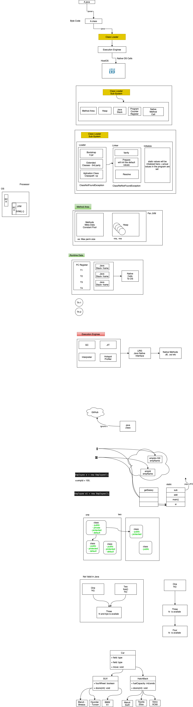

# JAVA Batch  AEM  2021 October 

  
- Rishabh - Btech electrical, bikaner, playing cricket, - watching movies - 6 /10 
- Aakash - Btech IT, playing TT, 4 / 10 
- Amit - Btech CS Bhopal MP, Wating movies, web series, 5/10 
- Ashutosh - Patna, Bihar, Btech kolkatta, CS, play cricket, 6.5/10
- Arjun - Btech CS, VIT, exploring foods, 4/10
- Bhavya - Btech, CS, AP, watching movies, listening music 5.5/10
- Hemanth - Btech E&C, 6.5/10, travelling 
- Lokesh - IT, Bareli, play cricket, swim ,  4/10
- Manav - Btech, CS, play foot ball, mutualfunds, cryptocurrency, 4/10 
- Mayuresh - Pune, BE CS, Dance, cricket, volley ball, 6.5/10
- Pankhuri - E&C, PSIT Kanpur, painting, listening music 4.5/10
- Ronak - CS, Ahmedabad, 8/10, stock markets, documentaries
- Sajid - CS,  delhi, python, C++, football 
- Srishti - CS, Kolkatta, writing quora, 6/10
- Shivanand- B tech, EC, learning technologies 6/10
- Utkarsh - Lukhnow, Btech CS, reading books, travelling 6/10 
- Vishav -  BE, E&C , travel, 3/10 
- Arti - Btech, CS, play badminton, cooking, 7/10 
- Yogesh - CS, Mumbai university, play chess, walking in evening, reading books, 5/10


## List of OOPS Concepts in Java 
- Inheritence 
- Encapulation
- Abstraction
- Polymorphism 

### JVM 
- - What is JVM 
- Change src to byte code 
- Platform independent 
- JDK VS JRE 
- in JRE you have JVM 
- JDK - Helps in compiling 

<hr/>


### Hello World Program 
```
public class Hello {
    public static void main(String [] args) {
        int x=10; 
        boolean flag; 
        System.out.println("Hello");
        System.out.println(x);
        System.out.println(flag);
        hi();
    }

    void hi() {}
}
```


- C / C++ 
```
#DEFINE main hello
    int hello() {}


    void main() {}
```


### Platform Independence 
- Windows - Java -> .java -> .class -> jvm 
- Mac - Java -> .java -> .class -> jvm 
- Sun Solaris  - Java -> .java -> .class -> jvm 
- Linux - Java -> .java -> .class -> jvm 
- 


### Tools needed 
- We will use Java- - IDE - Eclipse, IntelliJ, VS Code, Net Beans 




### Software List 
- https://www.eclipse.org/downloads/packages/release/neon/3/eclipse-ide-java-ee-developers
- https://git-scm.com/downloads
- https://code.visualstudio.com/download
- https://www.oracle.com/java/technologies/downloads/#java-  

## Day 1 Agenda 
- Creating Classes in Java, 
- Working with Classes in Java, 
- Making methods and classes final, 
- OOPS- Inheritance,
- Overriding methods, 
- Packages -Package access
- Documentation comments,  

## List of OOPS Concepts in Java 
- Inheritence 
- Encapulation
- Abstraction
- Polymorphism 


### Usage of variables 
- packages - lower case (com.ps.beans, org.ps.controller)
- varaibles - camel case (empId, salaryDrawn, address, withDraw)
- method names - camel case (getEmpId(), withDrawSalary(), makePayment(), getDataFromServer())
- class names - pascal case (Employee.java, HelloWorld.java, SomeController.java)
- constants - uppercase - (PI, LOCATION, VERSION)
- +++ indentation 

- What is a class 
    - is blue print of the object, 
    - Every class shall have characteristics 
  
- What is a Object 
- What is instance variable 
- what is static variable 
- What is static method 
- what is static block  
- what is local variable 


class Employee {
    int empId; 
    String empName;
    float empSalary
    int empDept;
    int empAge;

    void hi() {
        int x; 
    }
}


Employee e; 
Employee e = new Employee(); 


- jar file is collection of class files + properties etc 
- java documentation to understand .jar content 
- WORM - Write Once Read Many 
- DRY - Dont Repeate Yourself 


### Access Specifiers 
- Encapulation
  - public 
  - private 
  - protected
  - default (package)
- keep all your variable private, you access it with getters / setters 

### Access Modifiers 
- final 
- static 
- synchronized 
- Abstract 


PS 
- Employee (name, salary, address) -> injected to the system -> (***) -> Employee Details + EmpId (static)


- Inheritence  (Parent - child )
  - is-a (extends)
    - Employee is a Person 
    - Human is a animal 
    - ProjectManager is a Employee 

    - In java only simple inhe, multi level inhe is possible 


    ```
        class Car {
            public void drive() {}
            prirvate void drive1() {}
        }
        class Maruti extends Car {
             public void drive() {}
             void drive1() {} (x) 
        }
        class Hyundai extends Car {}
    ```


  - has-a 
    - Car has a mirror 
    - Bike has a petrol tank 
    - Holds the reference of another object 


```
    class Employee  {
        private int empId; 
        private Name name; 
        private double salary; 
        private Address address; 
    }

    class Customer  {
        private int customId; 
        private Name name; 
        private double income; 
        private Address address; 
    }

    class Address  {
        private int hNo; 
        private String street; 
        private int pin;
        private String state; 
        private String city; 

    }   

    class Name {
        private String firstName; 
        private String lastName; 
    }


    Employee emp = new Employee(); 
    Name name = new Name(); 
    name.setFirstName("Ronak"); 
    name.setLastName("Parmar"); 
    ...
    emp.setName(name); 
    ...

```


- polymorphism 
   1. Compile time 
      1. with the help of overloading it is done either by  method or constructor 
      2. same method name diff signature 
      3. happens in same class
   2. Run time 
      1. Overriding with method only 
      2. same method name same signature 
      3. happens in different class provided they are inherited (parent - child )
   
<br >

- if you have the class marked as final then you cannot inherit 
- if you have method marked as final then you cannot override 
- if you have the method as private then you cannot override 
- if you have the method as static then inheritence is not supported 


final - class level, method level, for constants 

```

class Dad - final
    - work 


class son(you)
    - work @Override 
    - play 


class son(brother)
    - work 
    - trekking 
 
 Dad <-  son 
 son(brother) <- son(you)
```


## Assignment 
```
    class Car {
        public void move() {
            System.out.println("Moves car"); 
        }
    }

    class SUV extends Car {
        boolean fourWheelDrive() {
            return true; 
        }
    }
    class HatchBack extends Car {
        public int fuelCapacity() {
            // generate random number (20-40)
            return the value 
        }
    }

    class Maruti extends SUV {
        // have few more methods
    }
    ... 

    class Maruti extends HatchBack {

    }
    

    class Client {
        public static void main(String [] args) {
            
        }
    }
```


# Day2 

- retro 
- how jar works 


## Agenda 
- Exception Handling and Assertions
- Exception handling with try-throw-catch-finally construct	
- Reference Types and Threading, 
- Working with types: Wrapper classes 


## List of OOPS Concepts in Java 
- [x] Inheritence 
- [x] Encapulation
- [x] Abstraction
- [x] Polymorphism 

- draw a car 


```
    abstract class Vehicle {
        public abstract void move();
    }
    abstract class Car extends Vehicle  {
        public abstract void steering();
        public void doors() {
            // all cars will have 4 doors 
        }
    }
    class Maruti extends Car {
        + Overriden Method move()
        public void abs() {}
    }
    class BMW extends Car {
        + Overriden Method move()
        public void airBags() {}
    }
```


## Abstraction 
- if you have a abstract method in the class it should be marked with ; 
- if you have atleast 1 abstract method then the class has to be marked as abstract
- if you have the abstract class then you cannot create an object (instantiate), but remember you can hold reference 
  - Car c; 
- if you have a abstract class which extends abstract class then having the implementation is optional 
- if you have any class which extends abstract class then the abstract mehtods should be overrident MANDATORY 
- an abstract class can have mix of abstract methods and concrete methods 

## Exception 

- if you have unchecked exception then you dont have to handle it explictily, JVM will take care by default 
- try - catch 
- try - catch catch 
- try - catch (specific) catch (specific) catch (generic)
- try - try - catch - try - catch 
- try - catch - finally 
- try - finally 
- try - catch -fianlly - try -catch 


### custom exception 
Salary - IT Return - declares some min salary limit - thorw some exception 
    - SalaryImproperException 
    - NameTooShortException 

throw - you can throw only 1 exception, is at statement level, your exception or java's exception 
throws - you can throw multiple, is at method level, your exception or java's exception 


## Interface's 
- Java support multiple inheritence with interfaces only 
- you can have a class implmenting more than 1 interfaces 
- an interface can extend 1 or more interfaces 
- an interface is 100% abstract 
- an interface is declared with keyword interface 
- an interface has nothing to do with object class 
- in interface the only access specifier is public 
- in interface you cannot have variables > final, static 


```
    interface Car {
        move(); 
    }
    interface IndianStandard {
        tyreMinSize();
    }
    interface KarnatakaStandara extends IndianStandard {

    }

    // the class implementing the interface have to override 
    // the mehtods which are in interface 
    class Maruti implements Car, IndianStandard {
        
    }
```


| Abstract Classes              | Interface                       |
| ----------------------------- | ------------------------------- |
| Class                         | Interface                       |
| Multi level                   | Multiple                        |
| extends                       | implements                      |
| has reference to object class | Nothing to do with Object class |
| can have concrete mehtod      | 100% abstract                   |
| you can have variables        | no variables here               |


- why are we using wrapper class why not type casting 
  - it gets associated with class 
  - from converting from one object to another object 
    ```
        int x=10; 
        double d = x; 
        short s = (short) d; 
    ```

- it cannot be directly stored in to secodary device (serialize)
- collection & generics they dont support primititve 
- to support java.util packages 
- one int x  -> two  


## Threads 

| Process                  | Threads                          |
| ------------------------ | -------------------------------- |
| OS Concept               | Programming concept              |
| Java, MS Word, Excel etc | main, T1-ronak, T2-ashotosh etc  |
| all controlled by OS     | Controlled by Developer          |
| priority managed by OS   | You can set  Min 1 Max 10 Norm 5 |


### Creating a thread 
1. Extend a class with Thread class 
2. Implmenting an interface Runnable (run)

plan 
casestudy 
github 


- What services are needed 
  - Beans 
  - Array 
  - Some Business logic which can work at CLI 
  - 


- on desktop 

> git config --global user.name "Naveen Kumar Srinivas (C)" 

> git config --global user.email "navkumar35@partners.publicisgroupe.net"

> git clone https://tools.publicis.sapient.com/bitbucket/scm/poatb/training.git

> git branch -a 

> git checkout main 

> ls 

> git add . 

> git commit -m "your comments" 

> git push origin main 

> git pull 


T1 - RONAK, MANAV 
T2 - AMIT, AAKASH 
T3 - ASHUTOSH, RISHAB
T4 - PANKHURI, ARJUN 
T5 - ARTI, MAYURESH 
T6 - SRISHTI, HEMANTH 
T7 - SAJID, LOKESH
T8 - UTKARSH, YOGESH
T9 - BHAVYA, VISHAV, SHIVANAND 


# Day 3 

- [x] Java Generics & Collections
- [x] Generics and Annotations
- [x] Collection classes,LIST, SET, MAP, GRAPH
- [ ] I/O Package 
  - InputStream , OutputStream classes, 
  - Reader Classes, and Writer classes	


- Generics 

List<> - raw types 
    - Hemanth
    - Shivanand
    - Tiger
    - Ant 
    - Elephant 

- type safe 
List< Integer >
    - 23
    - 45
    - 66
    - 77
    - 44
  
List < Employee >
    - Hemanth 
    - Shivanand 
    - Lokesh
    - Arti 


int arr [] = new int [4]; 
arr[0] = 100; 
arr[1] = 200; 
arr[2] = 300; 
arr[3] = 400; 
arr[4] = 500;  [x]

java.util 

- Iterable 
  - iterator() 
  - Collection 
    - ArrayList is a raw type. References to generic type ArrayList<E> should be parameterized
      - List  (stores duplicate also )
        - ArrayList 
        - Vector 
        - LinkedList
        - Stack 
        - Queue
      - Set (stores unique only )
          - HashSet - Unordered - Store First Stratergy 
          - TreeSet - Ordered- sorted (asc / desc) - the object should implement Comparable interface 
          - Comparator
Employee [empId=103, empName=Akash, age=21], 1221555852
Employee [empId=103, empName=Akash, age=21], 1705929636
Employee [empId=102, empName=Bhavya, age=21], 1297685781
Employee [empId=101, empName=Rishab, age=22], 5- 3308


Employee [empId=103, empName=Akash, age=21], 65
Employee [empId=103, empName=Akash, age=21], 65
Employee [empId=101, empName=Rishab, age=22], 82
Employee [empId=102, empName=Bhavya, age=21], 66


Employee [empId=103, empName=Akash, age=21], 65
Employee [empId=101, empName=Rishab, age=22], 82
Employee [empId=102, empName=Bhavya, age=21], 66


      - Map
        - HashMap
        - LinkHashMap
        - TreeMap
        <Key, Value> - Key - is unique, overrite 

        class FoodItem {
            String name; 
            double cost; 
        }

        Map<String, FoodItem> choice = new HashMap<String, FoodItem> (); 
        <"rishab", new FoodItem("Pizza", 100)>
        <"hemanth", new FoodItem("Burger", 234)> 

        List<FoodItem> choices = new ArrayList<FoodItem> (); 
        choices.add(new FoodItem("Pizza", 100)); 
        choices.add(new FoodItem("Burger", 200)); 

         <"rishab", choices>

        Map<String, List<FoodItem>> rishabChoices = new HashMap<String, List<FoodItem>>();


        Map<String, Map<String, List>>

        Map<String, List<Map<String, List>>>


to represent graph 

class Node {
    List<Node>
    int val; 
}

- Property 

GoodMorning - Good Morning, Shubodaya, Bonjour, 
GoodNight - Good Night, Shubharatri, bonne nuit

Map<String, String [] >
Map<String, ArrayList<String>>


- IO Operations 
  - Char - Reader /Writer 
  - Byte - InputStream / OutPutStream - you have to serialize 


---------------- 

1. Store new Synoym 
2. Get Synonym for Word
3. Exit 

1. Enter word 
   Hello 
    Please enter synonym (0 to exit)
    Bon 
    Hello 
    Namskara 
    0 

1. Store new Synoym 
2. Get Synonym for Word
3. Exit 

2. Please enter a word to look for synonym: Hello <enter>
    Bon 
    Hello 
    Namskara 

--- 
Difference Between 
- Scanner - function, all data is got in 1 go , sc.nextInt(), scanf, 
- Buffered Reader/InputStream - read data in the form of text / bytes, br.readLine() (ISR), cin >> , throws checked exception IOException 


--- 
# Day 4

What is a build tool?, Overview of Maven, Environment Setup, Maven POM File, Creating a java project using maven, Maven Directory Structure, Project
o External Dependencies
Maven Repository
Build Lifecycle, phases and goals
Executing the mvn command

Introduction to Git,  Creating branch, working with merge stratergy, working with remote Github/bitbucket"	


tools.publicissapient.com/bitbucket/yourrepo (username + password )

--global - shivanand 
--system - ronak 
--local - only for specific folder 

> c:\myfolder 

> c:\yourfolder 

> c:\somefolder 

> git config --global user.name "naveen kumar"

> git config --global user.email "llid@publicissapient.com"

> git config --global --edit 


> <esc> :wq - write and quit 
> <esc> :q - quit 
> <esc> :q! - force quit 

-   git commit -m "created main in first and package statement in second"
 -   git status
 
 - git remote -v 
 
 -   git branch 
 
 -   clear
 
 -   git log 
 
 -   git log --oneline 
 
 -   clear
 
 -   git branch new-branch
 
 -   git branch 
 
 -   pwd
 
 -   code . 
 
 -   clear
 
 -   git branch 
 
 -   git checkout new-branch 
 
 -   git branch 
 
 -   git status 
 
 -   git add . 
 
 -   git commit -m "class created"
 
 -   clear
 
 -   git branch 
 
 -   git checkout main 
 
 -   git checkout new-branch
 
 -   git checkout main 
 
 -   git add . 
 
 -   git commit -m "added syso"
 
 -   git status
 
 -   clear
 
 -   git branch 
 
 -   git checkout new-branch 
 
 -   git branch 
 
 -   git checkout main 
 
 -   git branch 
 
 -   git merge new-branch
 
 -   git branch 
 
 -   cler
 
 -   clear
 
 -   git log --oneline
 
 -   git log --oneline --graph --all 
 --decorate
 
 -   history --30 
$
 history -50


 -   ls

 -   vi Second.java

 -   git status 

 -   cat First.java

 -   cat Second.java

 -   git status 

 -   clear

 -   git add . 

 -   git status

 -   git commit -m "created main in first 
 and package statement in second"
 
 -   git status
 
 - git remote -v 
 
 -   git branch 
 
 -   clear
 
 -   git log 
 
 -   git log --oneline 
 
 -   clear
 
 -   git branch new-branch
 
 -   git branch 
 
 -   pwd
 
 -   code . 
 
 -   clear
 
 -   git branch 
 
 -   git checkout new-branch 
 
 -   git branch 
 
 -   git status 
 
 -   git add . 
 
 -   git commit -m "class created"
 
 -   clear
 
 -   git branch 
 
 -   git checkout main 
 
 -   git checkout new-branch
 
 -   git checkout main 
 
 -   git add . 
 
 -   git commit -m "added syso"
 
 -   git status
 
 -   clear
 
 -   git branch 
 
 -   git checkout new-branch 
 
 -   git branch 
 
 -   git checkout main 
 
 -   git branch 
 
 -   git merge new-branch
 
 -   git branch 
 
 -   git log --oneline
 
 -   git log --oneline --graph --all --decorate


-   git branch --help
-   git branch -a
-   git branch -d new-branch 
-   git branch -a 
-   git checkout --help
-   git checkout -b my-new-branch main 
-   git branch 
-   git diff main..my-new-branch
-   git status 
-   git add . 
-   git commit -m "new method called hello in my-new-branch"
-   git diff main..my-new-branch
-   git diff main^..my-new-branch
-   git diff main..my-new-branch^
-   git diff main..my-new-branch^^
-   git branch 
-   git branch -m new-branch
-   git branch 
-   git checkout main 
-   git branch 
-   git branch --merged
-   git branch --no-merged
-   git merge new-branch
-   git branch --no-merged
-   git log --oneline
-   git checkout -b intrim-checkout d127555
-   git branch 
-   git checkout main 
-   git log 
-   git log --oneline 
-   git log --oneline  -5 
-   git branch -d new-branch
-   git log --oneline 
-   history -20 
-   history -30 


- Branching strategy 
- Mono Repo Concept 


- create project 
    - command line 
      - mvn archetype:generate -DgroupId=com.mycompany.app -DartifactId=my-app -DarchetypeArtifactId=maven-archetype-quickstart -DarchetypeVersion=1.4 -DinteractiveMode=false
    - IDE - Eclipse 


log4j 
log4j2 
logback
slf4j 
etc... 

----

# Day 5 

-  Retro - Day 4 
- alternative of maven 
- what is the need of git how it is efficient 
- what is maven why do we use maven 


Section 1 - Lambda Expressions
Interface Static Methods , Default Methods, Functional Interfaces , Lambda Syntax, Using Lambdas, Function Descriptors, Method References, Choosing Functional Interfaces, Constructor References, Closures, Lambda Compositions

Section 2 - Streams API
What are Streams?, Stream Advantages,Stream Operations, Streams vs. Collections
Filtering and Mapping, Finding and Matching, Reductions
Numeric Streams,Infinite Streams, Building Streams, Collectors
Grouping and Partitioning, Parallel Streams 	

try 
    - Constructor References
    - Infinite Streams (random) or you should not pass the limit 


Afternoon 
    - Collectors
    - Grouping and Partitioning

```
    class MyClass {
        public static void main(String args[]) {
            Thread t = new Runnable() {
                public void run() {
                    // blah blah... 
                }
            }
        }
    }

    interface Runnable {
        public void run();
    }


 class MyClass {
        public static void main(String args[]) {
            Thread t =  () -> {// blah blah... };
            }
        }
    }

```

Hi -> BYE 


- consice 
- Increses the readability 
- reduces boiler plate code 
- it encourages funcational programming -> async 
- The jar file when we build will be compact 
- Code reuse etc... 


https://openjdk.java.net/jeps/126

```
    public void add(int x, int y) {
        return x +y 
    }

    ... 
    int res = add(10, 20); 

    int res = (x, y) -> x + y; 

```

- if an interface has 1 mehtod then it is called as funcationa interface 
- 


difference between collection and streams 
|----|-----|
| collection                        | stream                                                             |
| --------------------------------- | ------------------------------------------------------------------ |
| this is stored                    | this is used for computation                                       |
| the size can grow / shrink        | fixed Data structure                                               |
| it can be passive                 | it is only active                                                  |
| was there from long time          | introduced in Java 8                                               |
| they dont use funcation interface | they use funcational interface                                     |
| no concept of parallel processing | supports parallel processing                                       |
| you can modify the content        | streams dont modify the content, Integer, Float, Double, String... |
| ---                               | ---                                                                |


    - in lambda Way 
        accountList.sort((o1, o2) -> o1.getCustName().compareTwo(o2.getCustName())); 
    - in method reference way 
		accountList.sort(Comparator.comparing(Account:: getCustName));


T1 - RONAK, MANAV - Amit 
T2 - AMIT, AAKASH - Ashotosh
T3 - ASHUTOSH, RISHAB - Pankhuri
T4 - PANKHURI, ARJUN - Arti 
T5 - ARTI, MAYURESH - Srishti 
T6 - SRISHTI, HEMANTH - Sajid 
T7 - SAJID, LOKESH - Utkash 
T8 - UTKARSH, YOGESH - Bhavya 
T9 - BHAVYA, VISHAV, SHIVANAND -Ronak 


@Slf4j
Causes lombok to generate a logger field.

Complete documentation is found at the project lombok features page for lombok log annotations.

Example:

 @Slf4j
 public class LogExample {
 }
 
will generate:
 public class LogExample {
     private static final org.slf4j.Logger log = org.slf4j.LoggerFactory.getLogger(LogExample.class);
 }


 ----------------------


 # Day 6 

 - Assessment 
   - bitbucket https://tools.publicis.sapient.com/bitbucket/scm/poatb/assessment-1.git
   1. - git clone https://tools.publicis.sapient.com/bitbucket/scm/poatb/assessment-1.git
   2. git checkout main 
   3. git branch LLID-FIRSTNAME syntax, ex: git branch mankakka-manav, git branch panawasti-pankhuri
   4. git checkout mankakka-manav
   5. git branch 
   6. start writing the code 
   7. repeat git add ., git commit -m "assessment-1 submission by manav"
   8. git push origin mankakka-manav
1. Coding style 
   1. /** @author manav @see to insert record  */ 
   2. good naming conventions 


T1 - RONAK, MANAV - Amit 
T2 - AMIT, AAKASH - Ashotosh
T3 - ASHUTOSH, RISHAB - Pankhuri
T4 - PANKHURI, ARJUN - Arti 
T5 - ARTI, MAYURESH - Srishti 
T6 - SRISHTI, HEMANTH - Sajid 
T7 - SAJID, LOKESH - Utkash 
T8 - UTKARSH, YOGESH - Bhavya 
T9 - BHAVYA, VISHAV, SHIVANAND -Ronak 


{12.50=[Product 
            [name=marker, qty=133, price=12.50]
        ], 
23000.67=[Product 
            [name=laptop, qty=11, price=23000.67]
          ], 
65000.00=[Product 
            [
                name=laptop, qty=33, price=65000.00]
            ], 
3.67=[Product 
            [
                name=tag, qty=30, price=3.67
            ], 
    
    Product 
        [name=paper, qty=32, price=3.67], 
    Product 
        [name=paper, qty=32, price=3.67]
    ], 
19.99=[Product 
    [
        name=marker, qty=21, price=19.99
        ]
    ]
}

----------------
{12.50=[Product [name=marker, qty=133, price=12.50]], 23000.67=[Product [name=laptop, qty=11, price=23000.67]], 65000.00=[Product [name=laptop, qty=33, price=65000.00]], 3.67=[Product [name=tag, qty=30, price=3.67], Product [name=paper, qty=32, price=3.67]], 19.99=[Product [name=marker, qty=21, price=19.99]]}


------------------------ anonymous block vs named block vs lambda ------------------------------ 

```
1. 
@Data 
class Employee implements Comparable<Employee>{
    private int empId;
    private String empName; 

    public void compareTo(Object obj) {
        // lexographical check  
    }

}

class App {
    psvm() {
        new TreeSet<Employee>();
    }

}


2. @Data 
class Employee{
    private int empId;
    private String empName; 
}

// named way 
class EmployeeSorterTemplate{
    public List<Employee> sortAscByName(List<Employee> list) {
        Comparare<Employee> compare = new Compare<Employee>() {

            @Overrident
            public void compare(Employee e1, Employee e2) {
                    // you lexographical check 
            }   
        };

        Collections.sort(list, compare); 

    }
}


3. @Data 
class Employee{
    private int empId;
    private String empName; 
}

// un-named way 
class EmployeeSorterTemplate{
    public List<Employee> sortAscByName(List<Employee> list) {
        Collections.sort(list, new Compare<Employee>() {

            @Overrident
            public void compare(Employee e1, Employee e2) {
                    // you lexographical check 
            }   
        }); 

    }
}

4. 
// un-named way 
class EmployeeSorterTemplate{
    public List<Employee> sortAscByName(List<Employee> list) {
        Collections.sort(list,(Employee e1, Employee e2) ->  {
                    // you lexographical check 
        }); 

    }
}

class App {
    psvm() {
        new TreeSet<Employee>();
    }

}


```
 
> LambdaEx01.class
> LambdaEx01$1.class - 1. LambdaEx01 2. $1 - LambdaEx01$1$1.class - LambdaEx01$1$2.class
> LambdaEx01$2.class - 1. LambdaEx01 2. $2


-- HashMap 
    public V put(K key, V value) {
        return putVal(hash(key), key, value, false, true);
    }
-- HasTable 
    Account.balance = 1000;  - 10:00:00:00, - 10:00:00:01   -> if i allow get operation its okay, but should not withdraw again 
    public synchronize  void withDraw(Account account, Long amount) {
        if(amount < account.balance) {
            //process 
            /// the DB call is made - 500 ms 
            // updating the data - 500 ms 
            // confirming - 100 ms (total 1100ms)
        }
    }

     public synchronized V put(K key, V value) {
         ...
     }


-- list 
 private void add(E e, Object[] elementData, int s) {
        if (s == elementData.length)
            elementData = grow();
        elementData[s] = e;
        size = s + 1;
    }
-vector 
     public synchronized void addElement(E obj) {
        modCount++;
        add(obj, elementData, elementCount);
    }


A - Atomiticy 
C - Consitencey
I - Isolation 
D - Durability 


----- 
# Day 7 

---- 

T1 - RONAK, MANAV - Amit 
    - discussed about case study 
    - 
T2 - AMIT, AAKASH - Ashotosh
    - 
T3 - ASHUTOSH, RISHAB - Pankhuri
T4 - PANKHURI, ARJUN - Arti 
T5 - ARTI, MAYURESH - Srishti 
T6 - SRISHTI, HEMANTH - Sajid 
T7 - SAJID, LOKESH - Utkash 
T8 - UTKARSH, YOGESH - Bhavya 
T9 - BHAVYA, VISHAV, SHIVANAND -Ronak 


Basic overview of data structures - List, Map, Graph
Mutable vs Immutable, Iterating over Data Structures
Basic Search Algorithms - Binary, Quick, Merge : pros/cons
Understanding how to identify Time Complexity 
Choosing appropriate DS and Algo for Problem


|-------|---------|
| Algorithm                                               | Program                               |
| ------------------------------------------------------- | ------------------------------------- |
| Design                                                  | Implementation                        |
| step by step procedure to define given problem statment | Implemenation of an algoritm          |
| Domain Knowledge                                        | programming knowledge                 |
| any language                                            | specific language                     |
| dont worry about OS or H/W                              | worry about OS or H/W                 |
| design                                                  | implement + test                      |
| which takes an input and gives output                   | which takes an input and gives output |

--- 


| prior ananlysis                  | postiror analysis               |
| -------------------------------- | ------------------------------- |
| algorithm                        | program                         |
| agnostic to programming language | language dependent              |
| time and space complexity        | hardware (amout of data/ bytes) |
| -------------------------------- | ------------------------------- |

--- 


- Effectiveness 
``` 
    public int largeTwo(int num1, int num2) {
        if(num1 > num2) {
            return num1 
        }else {
            return num2; 
        }
    }
    --- 

    public int largeTwo(int num1, int num2) {
        if(num1 > num2) {
            return num1 
        }
            return num2; 
        
    }

    public int largeTwo(int num1, int num2) {
        return num1 > num2?num1:num2;
    }

    public int largeThree(int num1, int num2, int num3) {
        return num1>num2&&num1>num3?num1:num2>num3?num2:num3;
    }
```


- chararectistics of algorithm 
  - input - 0 or 1 or more 
  - output - atleast 1 
  - definiteness - if you can solve your computer should solve 
  - finiteness- surity of output, number of steps / duration (never web server / db server)
  - effectiveness - every statement should be effectived 

- how do you measure/analyze your algorithm 
  - time complexity - BigO notation / is for piece of code which may be converted in to program 
    - Network complexity - 5g edge computing 
    - Power - mobile / laptops 
    - CPU Registers - Device Driver applications 
  - space complexity 


- Anti Pattern 
- SOLID 


int *p = (*int) malloc(100); 
// do something 
free(p)


// to solve dictionary 
- list 
- set 
- map
  - hash - OLTP
  - tree - OLAP


- For writing algoritm you need have knowlege about OS, Processor how it works etc 

// ms, s, m, h, d, m-ms, 
for(int i=0; i<10; i++) {
    // do something 
}


-- to calculate time complextity 

> for(i=0; i<n; i++) = O(n)
> for(i=0; i<n; i+=2) = O(n)
> for(i=n; i>0; i--) = O(n)
> for(i=1; i<n; i*=2) = O(log 2 n) 
> for(i=1; i<n; i*=3) = O(log 3 n) 
> for(i=1; i<n; i*=4) = O(log 4 n) 
> for (i=n ;i > 0 ; i=i/2) = O(log 2 n)


singly linked list 

  - SinglyLinkedList 
      [head=Node 
          [value=Arti, next=null], 
      tail=Node 
          [value=Arti, next=null], 
      size=1]

SinglyLinkedList 
    [head=Node 
        [value=Bhavya, next=Node 
        [value=Arti, next=null]
        ], 
    tail=Node 
        [value=Arti, next=null], 
    size=2
    ]

SinglyLinkedList 
    [head=Node 
        [value=Bhavya, next=Node 
        [value=Arti, next=Node 
        [value=Lokesh, next=null]]], 
    tail=Node 
        [value=Lokesh, next=null], 
    size=3
    ]


